<div align="center">
  
  <h1>🌌 Logistix API & Architecture Blueprint</h1>
  <p><strong>A Comprehensive Reference of System Integrations, External APIs, and Core Services</strong></p>
</div>

---

## 🔌 1. External APIs Integration Directory

Logistix relies on a powerful, resilient network of external APIs to power its dynamic routing, safety audits, and automated verifications. Below is the combined matrix of integrated external APIs, their target service layers, integration protocols, and detailed functional profiles:

| External API & Protocol | Core Service Files | Deep Integration & Role Details |
| :--- | :--- | :--- |
| **Google Gemini API** <br> <sub>Direct REST Integration</sub> | [gemini_service.py](file:///Users/adrish/Desktop/Projects/logistix/backend/services/gemini_service.py) | • **Generative Intelligence:** Orchestrates generative analytics, C-Suite strategy recommendations, route summaries, conversational driver companion voice assistance, and natural language command parsing.<br>• **Resilience Fallback:** Automatically switches to a custom local heuristic fallback engine if keys hit quota limits or fail, fetching telemetry directly from the SQLite database to generate briefings. |
| **Google Cloud Vertex AI** <br> <sub>Google Cloud SDK</sub> | [route_engine.py](file:///Users/adrish/Desktop/Projects/logistix/backend/services/route_engine.py) <br> [alert_engine.py](file:///Users/adrish/Desktop/Projects/logistix/backend/services/alert_engine.py) | • **Predictive ETA:** Hosts scikit-learn models (trained on NYC Uber TLC trip datasets) in the GCP Vertex Model Registry to serve live ETA estimates.<br>• **Anomaly Classification:** Classifies real-time multi-sensor telemetry streams (wearable driver fatigue vitals, G-force accelerometer shock impact, cold chain perishable cargo temperatures) to detect safety violations. |
| **OSRM Routing API** <br> <sub>REST Web API</sub> | [route_engine.py](file:///Users/adrish/Desktop/Projects/logistix/backend/services/route_engine.py) | • **Road Distance Engine:** Queries the public Open Source Routing Machine engine to calculate precise road driving coordinates and travel distances instead of linear Haversine approximations. |
| **Open-Meteo Weather API** <br> <sub>REST Web API</sub> | [alert_engine.py](file:///Users/adrish/Desktop/Projects/logistix/backend/services/alert_engine.py) | • **Dynamic Climate Monitoring:** Fetches real-time weather alerts and conditions (precipitation, wind speed, temp) to alert managers and auto-trigger safety halts/diverts (e.g., heatwave stops, flood detours). |
| **Meta WhatsApp Cloud API** <br> <sub>Meta Graph API</sub> | [whatsapp_service.py](file:///Users/adrish/Desktop/Projects/logistix/backend/services/whatsapp_service.py) | • **Secure Communications:** Sends template-based secure verification OTP codes directly to driver handsets for dock check-ins and customer handover validations. |
| **Gmail SMTP Server** <br> <sub>SMTP Protocol</sub> | [email_service.py](file:///Users/adrish/Desktop/Projects/logistix/backend/services/email_service.py) | • **Notification Gateway:** Generates and dispatches responsive, high-end HTML transaction emails for onboarding credentials, company registration, and secure account deletion. |
| **OCR.space API** <br> <sub>Multipart REST API</sub> | [ocr_service.py](file:///Users/adrish/Desktop/Projects/logistix/backend/services/ocr_service.py) | • **Computer Vision Gatekeeper:** Extracts license plates and shipping manifests during gate check-ins. Bypasses resource-intensive local PyTorch dependencies with a lightweight cloud OCR connection. |
| **Is-on-Water API** <br> <sub>REST Web API</sub> | [water_check.py](file:///Users/adrish/Desktop/Projects/logistix/backend/services/water_check.py) | • **Geographic Validation:** Assesses coordinate boundaries to verify that newly registered hubs or route segments are physically located on land, preventing depot placements in oceans, lakes, or rivers. |
| **OSM Nominatim API** <br> <sub>OpenStreetMap API</sub> | [water_check.py](file:///Users/adrish/Desktop/Projects/logistix/backend/services/water_check.py) | • **Reverse Geocoding Fallback:** Translates coordinate arrays to OSM geocoding nodes to parse address keywords (e.g., "lake", "canal", "wetland", "river") for water check confirmation. |

---

## ⚙️ 2. FastAPI Backend Directory & Service Classification

The Logistix backend is architected around a modular structure separating the REST API layer, database integrations, machine learning models, and core logic services.

### 📂 Directory Structure

```
backend/
├── main.py                     # Application entrypoint & WebSocket setup
├── database.py                 # SQLite/Turso client & WAL configuration
├── models.py                   # Pydantic schemas & data validation
├── ml_prep.py                  # Telemetry preprocessing utilities
├── ml/                         # Saved ML models (e.g. Random Forest ETA models)
├── routers/                    # Persona-specific API endpoints
└── services/                   # Business logic and external service integrations
```

---

### 🛣️ API Routers Layer (`backend/routers/`)

The API layer is subdivided into distinct routers targeting specific domains and user personas. Each router file exposes dedicated REST endpoints:

| API Router File | Route Prefix | Primary Focus | Key Responsibilities |
| :--- | :--- | :--- | :--- |
| [auth.py](file:///Users/adrish/Desktop/Projects/logistix/backend/routers/auth.py) | `/api/auth` | User Authentication | Handshakes JWTs, manager signup, profile registrations, and OTP validation checks. |
| [manager.py](file:///Users/adrish/Desktop/Projects/logistix/backend/routers/manager.py) | `/api/manager` | Manager Dashboard | Oversees fleet analytics, warehouse depots, financial ledgers, and resilience tests. |
| [driver.py](file:///Users/adrish/Desktop/Projects/logistix/backend/routers/driver.py) | `/api/driver` | Driver Companion App | Handles task progression, digital wallet transactions, fatigue logs, and voice configurations. |
| [shipment.py](file:///Users/adrish/Desktop/Projects/logistix/backend/routers/shipment.py) | `/api/shipments` | Shipment Lifecycle | Manages shipment creation, multi-leg splits, auto-assignment details, and ESG carbon indices. |
| [tracking.py](file:///Users/adrish/Desktop/Projects/logistix/backend/routers/tracking.py) | `/api/tracking` | Geospatial Map | Emits real-time coordinate updates, weather polyline alerts, and event logs. |
| [simulation.py](file:///Users/adrish/Desktop/Projects/logistix/backend/routers/simulation.py) | `/api/simulation` | Scenario Runner | Simulates route progress, vehicle health degradations, and calamity activations. |
| [fuel_oracle.py](file:///Users/adrish/Desktop/Projects/logistix/backend/routers/fuel_oracle.py) | `/api/fuel` | Bharat-Fuel Index | Computes vehicle class-based pricing estimates for gas and electric grids. |
| [iot.py](file:///Users/adrish/Desktop/Projects/logistix/backend/routers/iot.py) | `/api/iot` | IoT Telemetry | Receives real-time sensor updates for driver heart rate, G-force impact, and cargo temperature. |

---

### 🧪 Core Services Layer (`backend/services/`)

The services layer handles complex calculations, background validations, and downstream communication. It is classified into the following modules:

#### 🚨 Alerting & Safety
* [alert_engine.py](file:///Users/adrish/Desktop/Projects/logistix/backend/services/alert_engine.py): Executes real-time anomaly detection against incoming IoT telemetry, classifying driver fatigue indexes, impact G-force shocks, and cold chain temperature thresholds.
* [water_check.py](file:///Users/adrish/Desktop/Projects/logistix/backend/services/water_check.py): Verifies geographic locations of newly registered depots to block placement errors inside open sea or lakes.
* [driver_intel.py](file:///Users/adrish/Desktop/Projects/logistix/backend/services/driver_intel.py): Audits wearability metrics and biosensor fatigue telemetry for on-duty drivers.

#### 🗺️ Routing & Optimization
* [route_engine.py](file:///Users/adrish/Desktop/Projects/logistix/backend/services/route_engine.py): Implements the **World's Strongest Route Splitter** (splitting shipments into first-mile, middle-mile, and last-mile legs), calamity-aware rerouting, and E-Way Bill deadline monitoring.
* [assignment.py](file:///Users/adrish/Desktop/Projects/logistix/backend/services/assignment.py): Auto-assigns compatible drivers and vehicles based on coordinate proximity, route legs, and driver health scores.
* [cold_chain.py](file:///Users/adrish/Desktop/Projects/logistix/backend/services/cold_chain.py): Calculates vitality index decays and humidity status metrics for perishable transport.

#### 💬 Communication & Gateways
* [whatsapp_service.py](file:///Users/adrish/Desktop/Projects/logistix/backend/services/whatsapp_service.py): Integrates with Meta's Graph APIs to send automated dispatch and delivery verification OTPs to drivers.
* [email_service.py](file:///Users/adrish/Desktop/Projects/logistix/backend/services/email_service.py): Formulates context-aware HTML layouts (onboarding, security alerts, data deletion) and dispatches them via SMTP.
* [ocr_service.py](file:///Users/adrish/Desktop/Projects/logistix/backend/services/ocr_service.py): Connects to the OCR cloud parsing engine to extract vehicle license plates and shipping manifests from gate scans.
* [iot_gateway.py](file:///Users/adrish/Desktop/Projects/logistix/backend/services/iot_gateway.py): Generates mock sensor telemetry data streams (vitals, shock, temperatures) for developmental scenarios.

#### 🧮 Infrastructure & Utilities
* [gemini_service.py](file:///Users/adrish/Desktop/Projects/logistix/backend/services/gemini_service.py): Wraps Google Gemini generative content queries, handling key rotation pools and executing SQLite fallback algorithms.
* [turso_db.py](file:///Users/adrish/Desktop/Projects/logistix/backend/services/turso_db.py): Communicates with Turso (libSQL) edge databases, maintaining sync loops with the local database instance.
* [finance_engine.py](file:///Users/adrish/Desktop/Projects/logistix/backend/services/finance_engine.py): Manages financial distributions, calculating trip costs, driver payouts, milestone bonuses, and ledger entries.
* [simulation_engine.py](file:///Users/adrish/Desktop/Projects/logistix/backend/services/simulation_engine.py): Drives simulated transit trajectories, stepping vehicles through route coordinates.
* [strategy_engine.py](file:///Users/adrish/Desktop/Projects/logistix/backend/services/strategy_engine.py): Reviews ESG compliance rankings and evaluates carbon footprint outputs.
* [kv_store.py](file:///Users/adrish/Desktop/Projects/logistix/backend/services/kv_store.py): Directs lightweight memory-mapped key-value caching.
* [time_utils.py](file:///Users/adrish/Desktop/Projects/logistix/backend/services/time_utils.py): Provides standardized UTC ISO time calculations.

---

## 🗺️ 3. Core Operational Workflow Flowchart

Below is the comprehensive, loop-capable operational state machine for the Logistix network. Section 3.1 displays a visual UTF-8 layout for terminal-friendly reading, and Section 3.2 hosts the neon-glow themed system architecture preview graph.

### 🌌 3.1. Terminal Workflow & State Machine Map

```text
 🌌 LOGISTIX CORE WORKFLOW BLUEPRINT & STATE MACHINE
 ══════════════════════════════════════════════════════════════════════════════════
 
   [1. ONBOARDING & SETUP]
   🏢 Executive Portal Onboarding ➔ Configures Company ID
   ├─► Register Depots/Warehouses ➔ Set storage capacities
   └─► Register Vehicles/Fleet & Onboard Driver Accounts
               │
               ▼
   [2. SAFETY & OCR GATE AUDITS]
   🏭 Gate Camera captures vehicle plate ➔ Cloud OCR extracts plate & manifest
   ├─► Fuzzy Match < 65%?  ➔ [MANUAL DISPATCH AUDIT OVERRIDE] ──┐
   └─► Fuzzy Match >= 65%? ➔ [MARK DRIVER & VEHICLE ACTIVE] ◄──┘
               │
               ▼
   [3. INTELLIGENT DISPATCH & ROUTING (SPLIT)]
   🏢 Consult Gemini AI Strategy Oracle & Bharat-Fuel Price Index
   └─► Create Shipment ➔ OSRM calculates real road driving distances
               │
               ▼
       Is route distance >= 50km?
       ├─► [NO]  ➔ [DIRECT ROUTE LEG] ──┐
       └─► [YES] ➔ [SPLIT SOLVER] ──────┴─► Auto-decompose journey:
                                            [First-Mile ➔ Middle-Mile ➔ Last-Mile]
                                                         │
                                                         ▼
                                            [COMBINATORIAL AUTO-ASSIGNMENT]
                                            Locks closest compatible driver & fleet
                                                         │
               ┌─────────────────────────────────────────┴─────────────────────────────────────────┐
               ▼ (Drone Dispatch)                                                                  ▼ (Ground Dispatch)
   [4. HUB DEPOSIT & SCHEDULING]                                                     [5. TRANSIT OPERATIONS & COMPLIANCE]
   🏭 Hub dashboard updates congestion indexes                                        🚚 Driver PWA receives Task Card & VCE commands
   ├─► Dock Scheduling allocates loading bay slot                                    └─► Driver inputs 6-digit Pickup OTP
   └─► Verify cargo payload for Drone Leg?                                                       │
       ├── [YES] (Weight <= 10kg & Battery >= 20%) ➔ [DRONE DISPATCH] ──┐                        ▼
       └── [NO]  ➔ Route back to Ground Leg ────────────────────────────┼───────────► [LEG IN-TRANSIT LOOP] ◄──────────────┐
                                                                        │                        │                         │
 ┌──────────────────────────────────────────────────────────────────────┼────────────────────────┼─────────────────────────┤
 │                                                                      │                        │                         │
 ├──► [WEARABLE VITALS CHECK] ──► Fatigue Index > 65%? ──► [YES] ➔ [REST STOP ENFORCED] ─────────┤                         │
 │                                └── [NO] ➔ [OK]                  Alert Manager ➔ Wait to clear │                         │
 │                                                                                               │                         │
 ├──► [FLEET HEALTH CHECK] ─────► Breakdown Event? ──────► [YES] ➔ [EMERGENCY REASSIGNMENT] ─────┤                         │
 │                                └── [NO] ➔ [OK]                  Unassign Driver ➔ Re-run solver                         │
 │                                                                                               │                         │
 ├──► [ENVIRONMENTAL CHECK] ────► Disaster polyline? ────► [YES] ➔ Within Vehicle class Divert?  │                         │
 │                                └── [NO] ➔ [OK]                  ├── [YES] ➔ [AI AUTO-DIVERT] ─┤                         │
 │                                                                 │           Resplit remaining │                         │
 │                                                                 └── [NO]  ➔ [AI EMER HALT] ───┤                         │
 │                                                                                               │                         │
 └──► [COMPLIANCE CHECK] ───────► Predicted ETA > Expire? ──► [YES] ➔ [COMPLIANCE RETURN] ───────┤                         │
                                  └── [NO] ➔ [OK]                  Reverse pickup/drop targets   │                         │
                                                                   Re-run Auto-Assignment        │                         │
 ┌───────────────────────────────────────────────────────────────────────────────────────────────┘                         │
 │                                                                                                                         │
 └─────────────────────────────────────────────────────────────────────────────────────────────────────────────────────────┘
                                                                        │
                                                                        ▼
                                                             [6. ARRIVE & DELIVERY]
                                                             📦 Receiver tracks live GPS & dynamic ETA
                                                             └─► Receiver generates Delivery OTP
                                                                         │
                                                                         ▼
                                                             [DRIVER VERIFICATION]
                                                             Driver enters Delivery OTP code
                                                                         │
                                                                         ▼
                                                             [LEDGER & ESG RESOLUTION]
                                                             Ledger payouts split ➔ Carbon ESG saved
```

### 📊 3.2. System Architecture Graph

```mermaid
flowchart TD
    %% Custom bioluminescent palette
    classDef manager fill:#0d1b2a,stroke:#3a86ff,stroke-width:2px,color:#3a86ff;
    classDef hub fill:#0b1a13,stroke:#00f5d4,stroke-width:2px,color:#00f5d4;
    classDef driver fill:#1a1608,stroke:#ffb703,stroke-width:2px,color:#ffb703;
    classDef receiver fill:#160a24,stroke:#dec9ff,stroke-width:2px,color:#dec9ff;
    classDef system fill:#051630,stroke:#0f3b75,stroke-width:2px,color:#3b82f6;

    %% Nodes
    Onboard["Manager Onboards & Configures Company ID"]
    SetupHubs["Create Hub Depots & Assign Capacities"]
    FleetSetup["Register Fleet & Onboard Drivers"]
    ConsultOracle["Consult Gemini AI Strategy Oracle & Bharat-Fuel Price Index"]
    GateOCR["OCR Gate scan of plate & manifest"]
    VerifyOCR{"Fuzzy OCR Match >= 65%?"}
    ManualVerify["Manual Dispatch Audit Override"]
    MarkActive["Set driver & vehicle as active"]
    CreateShipment["Create Shipment & Query OSRM Road Distance"]
    CheckDist{"Distance >= 50km?"}
    DirectRoute["Direct Routing Leg"]
    SplitEngine["Decompose Route: First / Middle / Last-Mile Legs"]
    AutoAssign["Auto-Assignment Solver: Matches closest active asset"]
    HubDashboard["Hub Manager Dashboard updates congestion"]
    DockSchedule["Dock Scheduling assigns bay slots"]
    CheckDrone{"Payload <= 10kg & Battery >= 20%?"}
    DroneLaunch["Dispatch autonomous drone leg"]
    GroundLeg["Queue for standard ground vehicle leg"]
    TaskCard["Driver handset loads task card & Voice VCE commands"]
    PickupOTP["Driver enters 6-digit pickup OTP"]
    InTransit["Leg status set to In-Transit"]
    CheckFatigue{"Fatigue Sensor Eye/HR > 65%?"}
    FatigueHalt["Enforce Haptic Rest stop & Notify Manager"]
    CheckBreakdown{"Vehicle Breakdown triggered?"}
    EmergencyReassign["Execute /emergency-reassign: Auto-swap drivers"]
    DisasterSim{"Resilience Simulator Calamity triggered?"}
    CheckDivert{"Within vehicle class divert limit?"}
    AIAutoDivert["AI Auto-Divert: Resplit remaining legs & Reassign drivers"]
    EmergencyHalt["AI Emergency Halt: seek nearest safe open area"]
    CheckExpiry{"Predicted ETA > E-Way Bill Expiry?"}
    ComplianceReturn["Compliance Return: Reverse pickup/drop & re-run assignment"]
    TransitRoute["Driver follows OSRM navigation map"]
    ArriveDrop["Arrive at Destination Drop"]
    TrackPortal["Receiver tracks live vehicle GPS & dynamic ETA"]
    VerifyDeliveryOTP["Receiver verifies Delivery OTP"]
    LedgerPfund["Execute ledger payouts, milestone rewards, and Carbon ESG ratings"]

    %% Styles
    class Onboard,SetupHubs,FleetSetup,ConsultOracle,CreateShipment,CheckDist,DirectRoute,SplitEngine,AutoAssign,LedgerPfund manager;
    class GateOCR,VerifyOCR,ManualVerify,MarkActive,HubDashboard,DockSchedule,CheckDrone,DroneLaunch,GroundLeg hub;
    class TaskCard,PickupOTP,InTransit,CheckFatigue,FatigueHalt,CheckBreakdown,EmergencyReassign,CheckDivert,AIAutoDivert,EmergencyHalt,CheckExpiry,ComplianceReturn,TransitRoute,ArriveDrop driver;
    class TrackPortal,VerifyDeliveryOTP receiver;
    class DisasterSim system;

    %% Onboarding & Setup
    Onboard --> SetupHubs
    SetupHubs --> FleetSetup
    FleetSetup --> GateOCR
    GateOCR --> VerifyOCR
    VerifyOCR -- "No" --> ManualVerify
    ManualVerify --> MarkActive
    VerifyOCR -- "Yes" --> MarkActive

    %% Route Split & Assignment
    MarkActive --> ConsultOracle
    ConsultOracle --> CreateShipment
    CreateShipment --> CheckDist
    CheckDist -- "No" --> DirectRoute
    CheckDist -- "Yes" --> SplitEngine
    DirectRoute --> AutoAssign
    SplitEngine --> AutoAssign

    %% Hub Operations
    AutoAssign --> HubDashboard
    HubDashboard --> DockSchedule
    HubDashboard --> CheckDrone
    CheckDrone -- "Yes" --> DroneLaunch
    CheckDrone -- "No" --> GroundLeg
    DroneLaunch --> ArriveDrop
    GroundLeg --> TaskCard

    %% Driver Transit Loop
    TaskCard --> PickupOTP
    PickupOTP --> InTransit
    InTransit --> CheckFatigue

    %% Active Safety: Fatigue
    CheckFatigue -- "Yes" --> FatigueHalt
    FatigueHalt -->|Wait for recovery| InTransit
    CheckFatigue -- "No" --> CheckBreakdown

    %% Active Safety: Breakdown
    CheckBreakdown -- "Yes" --> EmergencyReassign
    EmergencyReassign --> AutoAssign
    CheckBreakdown -- "No" --> DisasterSim

    %% Active Safety: Disaster Simulation
    DisasterSim -- "Yes" --> CheckDivert
    CheckDivert -- "Yes" --> AIAutoDivert
    AIAutoDivert --> AutoAssign
    CheckDivert -- "No" --> EmergencyHalt
    DisasterSim -- "No" --> CheckExpiry

    %% Active Safety: Expiry
    CheckExpiry -- "Yes" --> ComplianceReturn
    ComplianceReturn --> AutoAssign
    CheckExpiry -- "No" --> TransitRoute

    %% Delivery & Handoff
    TransitRoute --> ArriveDrop
    ArriveDrop --> TrackPortal
    TrackPortal --> VerifyDeliveryOTP
    VerifyDeliveryOTP --> LedgerPfund
```



---

## 👥 4. Stakeholder Portals & Frontend Page Directory

Logistix segregates supply chain operations into four specialized portals customized for each participant in the logistics network.

### 🏢 4.1. Executive / Regional Manager
* **Role Profile:** Direct corporate command center. Regional and executive managers use this portal to oversee fleet analytics, database health, driver safety benchmarks, system configurations, and dynamic resilience controls across the entire network.
* **Portal Pages & Functions:**
  * [executive_dashboard.html](file:///Users/adrish/Desktop/Projects/logistix/frontend/pages/executive_dashboard.html): Main administrative command center detailing overall KPIs, active shipments, carbon footprint counters, and direct fleet status.
  * [executive_drivers.html](file:///Users/adrish/Desktop/Projects/logistix/frontend/pages/executive_drivers.html): Comprehensive list of all registered drivers, managing their shift hours, driver safety rankings, and base warehouse associations.
  * [executive_fuel_oracle.html](file:///Users/adrish/Desktop/Projects/logistix/frontend/pages/executive_fuel_oracle.html): Connects to the national fuel index pricing index, optimizing route fuel estimations based on diesel/petrol/gas indices and vehicle class metrics.
  * [executive_hub_leaves.html](file:///Users/adrish/Desktop/Projects/logistix/frontend/pages/executive_hub_leaves.html): Manages localized employee leaves and driver dispatch constraints across regional hubs.
  * [executive_leaderboard.html](file:///Users/adrish/Desktop/Projects/logistix/frontend/pages/executive_leaderboard.html): Displays relative rankings of drivers and hub performance metrics to encourage operational excellence.
  * [executive_messages.html](file:///Users/adrish/Desktop/Projects/logistix/frontend/pages/executive_messages.html): Communication dashboard enabling broadcasts and targeted message exchanges with warehouse managers and drivers.
  * [executive_oracle.html](file:///Users/adrish/Desktop/Projects/logistix/frontend/pages/executive_oracle.html): Text-based AI Strategy interface directly communicating with Gemini models to query operational instructions, logistics logs, and ESG trends.
  * [executive_payments.html](file:///Users/adrish/Desktop/Projects/logistix/frontend/pages/executive_payments.html): Logs transaction history and driver performance milestones.
  * [executive_receivers.html](file:///Users/adrish/Desktop/Projects/logistix/frontend/pages/executive_receivers.html): Catalogues active cargo receivers, coordinate drops, and delivery histories.
  * [executive_resilience.html](file:///Users/adrish/Desktop/Projects/logistix/frontend/pages/executive_resilience.html): Reroutes fleet streams by simulating catastrophic network blockades (e.g., driver strikes, cyclones, earthquakes, flood zones).
  * [executive_safety.html](file:///Users/adrish/Desktop/Projects/logistix/frontend/pages/executive_safety.html): Safety command center reporting live telemetry anomalies, G-force alerts, temperature thresholds, and driver fatigue indicators.
  * [executive_shipments.html](file:///Users/adrish/Desktop/Projects/logistix/frontend/pages/executive_shipments.html): Orchestrates shipment registrations, leg decompositions, auto-assignment details, and manual route splitting controls.
  * [executive_system.html](file:///Users/adrish/Desktop/Projects/logistix/frontend/pages/executive_system.html): System-wide configurations, toggle parameters for AI combinatorial solvers, and credential keys management.
  * [executive_verifications.html](file:///Users/adrish/Desktop/Projects/logistix/frontend/pages/executive_verifications.html): Verifies business license plate updates and driver identity submissions.
  * [executive_warehouses.html](file:///Users/adrish/Desktop/Projects/logistix/frontend/pages/executive_warehouses.html): Catalogues registered warehouse networks, capacities, storage boundaries, and active local congestion indicators.
  * [executive_weather.html](file:///Users/adrish/Desktop/Projects/logistix/frontend/pages/executive_weather.html): Leaflet.js weather fleet map showing live storm cells, flood polylines, and active vehicle coordinates.

---

### 🏭 4.2. Warehouse Hub Manager
* **Role Profile:** Local operations supervisor. Hub managers monitor localized docks, verify driver fitness during clock-ins, oversee autonomous drone hubs, and handle cargo verifications.
* **Portal Pages & Functions:**
  * [hub_manager_dashboard.html](file:///Users/adrish/Desktop/Projects/logistix/frontend/pages/hub_manager_dashboard.html): Overview of specific depot parameters (dock occupations, active inbound parcels, drone pads status, and local alert tickers).
  * [hub_manager_audit.html](file:///Users/adrish/Desktop/Projects/logistix/frontend/pages/hub_manager_audit.html): Verifies physical conditions, fleet assets, maintenance records, and employee shift schedules for the hub.
  * [hub_manager_drones.html](file:///Users/adrish/Desktop/Projects/logistix/frontend/pages/hub_manager_drones.html): Real-time monitor of short-range drone pads, showing autonomous drone battery percentages, flight telemetry, and cargo loads.
  * [hub_manager_fleet.html](file:///Users/adrish/Desktop/Projects/logistix/frontend/pages/hub_manager_fleet.html): Catalogs all localized vehicles (trucks, vans, LCVs) and tracks mechanical status/health indicators.
  * [hub_manager_gate.html](file:///Users/adrish/Desktop/Projects/logistix/frontend/pages/hub_manager_gate.html): Gate management board scheduling arrivals and departures to minimize idle queues at loading docks.
  * [hub_manager_leaderboard.html](file:///Users/adrish/Desktop/Projects/logistix/frontend/pages/hub_manager_leaderboard.html): Displays driver performance metrics relative to the local hub.
  * [hub_manager_payments.html](file:///Users/adrish/Desktop/Projects/logistix/frontend/pages/hub_manager_payments.html): Logs local operational expenses.
  * [hub_manager_settings.html](file:///Users/adrish/Desktop/Projects/logistix/frontend/pages/hub_manager_settings.html): Configures warehouse capacity limits, drone pads, and default geo-locations.
  * [hub_manager_shipments.html](file:///Users/adrish/Desktop/Projects/logistix/frontend/pages/hub_manager_shipments.html): Oversees parcels currently stored in the warehouse or scheduled to arrive.
  * [hub_manager_verifications.html](file:///Users/adrish/Desktop/Projects/logistix/frontend/pages/hub_manager_verifications.html): Facilitates OCR gate checks, analyzing images of license plates and cargo manifests to log check-ins automatically.

---

### 🚚 4.3. Driver (Driver Companion PWA)
* **Role Profile:** Fleet operator on the ground. Drivers run a mobile-first portal to handle task updates, report breakdowns, verify cargo pickups, view dynamic routes, check electronic wallets, and communicate hands-free.
* **Portal Pages & Functions:**
  * [driver_dashboard.html](file:///Users/adrish/Desktop/Projects/logistix/frontend/pages/driver_dashboard.html): Main mobile console showing current task cards, overall metrics, and quick safety alert tickers.
  * [driver_account.html](file:///Users/adrish/Desktop/Projects/logistix/frontend/pages/driver_account.html): Displays driver profile fields, assigned vehicle registration plate, and current health/fitness scores.
  * [driver_chat.html](file:///Users/adrish/Desktop/Projects/logistix/frontend/pages/driver_chat.html): Real-time chat client supporting hands-free typing and natural voice translations to message managers.
  * [driver_history.html](file:///Users/adrish/Desktop/Projects/logistix/frontend/pages/driver_history.html): Logs all historical shipments completed by the driver, listing locations and delivery timestamps.
  * [driver_live.html](file:///Users/adrish/Desktop/Projects/logistix/frontend/pages/driver_live.html): Navigation console showing active route maps, next waypoints, and weather-driven rerouting alerts.
  * [driver_tasks.html](file:///Users/adrish/Desktop/Projects/logistix/frontend/pages/driver_tasks.html): Task checklist displaying detailed parcel details, pickup validation codes, and signature forms.
  * [driver_wallet.html](file:///Users/adrish/Desktop/Projects/logistix/frontend/pages/driver_wallet.html): Displays earnings history and trip completion details.

---

### 📦 4.4. Receiver (Customer Portal)
* **Role Profile:** End recipient of the parcel. Receivers check delivery coordinates, verify shipping values, and hand over secure verification OTPs to confirm successful delivery.
* **Portal Pages & Functions:**
  * [receiver_portal.html](file:///Users/adrish/Desktop/Projects/logistix/frontend/pages/receiver_portal.html): Main customer portal dashboard where receivers can view active parcel orders, verify shipping lists, and trigger delivery handoffs.
  * [track.html](file:///Users/adrish/Desktop/Projects/logistix/frontend/pages/track.html): Real-time geospatial delivery tracking interface showcasing live map markers of transit vehicles and computed dynamic ETAs.

---

## 🛠️ 5. Development Tools & UI/UX Design Methodology

The Logistix ecosystem was built by combining advanced agentic AI capabilities for full-stack engineering with modern design tooling.

* **Backend & Core Engineering (Antigravity):** The vast majority of the application logic, databases, safety fallback rules, OSRM coordinate math, and microservice connections were coded, debugged, and optimized using **Antigravity**—Google DeepMind's advanced agentic pair-programmer.
* **UI/UX Ideation & Layouts (Gemini Canvas & ChatGPT):** Initial component behaviors, Glassmorphism CSS presets, regional translations key structures, and premium typography suggestions were brainstormed and drafted using **Gemini Canvas** and **ChatGPT**.
* **Visual Identity & Vector Prototyping (Figma):** User persona flows, color systems (neon highlights against deep dark-mode overlays), vector logo/icon coordinates, and pixel-perfect responsive dashboard mockups were designed in **Figma** before being converted to vanilla web components.
