<div align="center">
  
  <h1>🌌 Logistix API & Architecture Blueprint</h1>
  <p><strong>A Comprehensive Reference of System Integrations, External APIs, and Core Services</strong></p>
</div>

---

## ⚡ 1. Evaluator Quick-Start & Credentials Directory

> [!NOTE]
> **Short on time?** Use these pre-configured login credentials to immediately access the different stakeholder portals of Logistix and see all operations in action:
> 
> * **Company ID:** `1cd1e383-5cba-45ee-b38d-c14b4a080a44`
> * **Manager Portal Login:**
>   * **Email:** `work.nidhip06@gmail.com`
>   * **Password:** `123`
> * **Driver Portal Login:**
>   * **Driver ID:** `ravi.sharma1`
>   * **Password:** `Pass@8432`
> * **Warehouse Manager Portal Login:**
>   * **Warehouse ID / Email:** `a@g.com`
>   * **Password:** `123`

### 🔑 Google Gemini API Keys & Fail-Safe Mechanics

To make evaluation easy, we pre-loaded **5 free Google Gemini API keys** in the **AI API Configuration** settings page.
* **Automatic Key Rotation:** The backend automatically switches between these keys to avoid rate limits and keep AI features working without interruption.
* **Add Your Own Keys:** You can paste your own Gemini API key into the **Settings** page, and the platform will start using it immediately.
* **Backup Fallback Engine:** If the keys run out of quota or fail, our local rule-based system takes over automatically. It uses local database records to keep briefings, route splitting, and safety alerts running with zero downtime.

---

## 🏆 2. Key Features Showcase

Here are the 12 most important features built into Logistix that solve real shipping problems. Each of these features can be tested directly in the code and portals:

1. **Dynamic Route Splitting & Re-routing:** Automatically divides long journeys into first-mile, middle-mile, and last-mile parts. It assigns them to the best transport types in [route_engine.py](file:///Users/adrish/Desktop/Projects/logistix/backend/services/route_engine.py).
2. **Calamity-Aware Rerouting Gates:** Detects active disasters (like storm cells or floods) on the map and uses Gemini AI (or backup rules) to calculate detour paths in [route_engine.py](file:///Users/adrish/Desktop/Projects/logistix/backend/services/route_engine.py).
3. **Automated Fleet Rescue Swap:** Instantly transfers cargo tasks to the nearest compatible backup vehicle if a truck breaks down on the road to keep dispatches moving in [assignment.py](file:///Users/adrish/Desktop/Projects/logistix/backend/services/assignment.py).
4. **E-Way Bill Compliance Checker:** Monitors active deliveries in real-time. If it predicts that a travel permit (E-Way Bill) is about to expire, it automatically routes the shipment back to the sender in [route_engine.py](file:///Users/adrish/Desktop/Projects/logistix/backend/services/route_engine.py).
5. **Hands-Free Driver Voice Companion:** Built into the driver's web dashboard. Drivers can use speech commands (like "breakdown" or "resting") to update tasks hands-free in [driver_dashboard.html](file:///Users/adrish/Desktop/Projects/logistix/frontend/pages/driver_dashboard.html).
6. **Dynamic Multi-Language UI Translation:** Lets users translate all portals on the fly (supporting English, Hindi, Marathi, and more) with a single click and zero page reloads.
7. **Fuzzy OCR Gate Verification Loop:** Scans truck license plates at gates using OCR. If the match score is low, it loops managers in to review and approve the check-in in [ocr_service.py](file:///Users/adrish/Desktop/Projects/logistix/backend/services/ocr_service.py).
8. **Geospatial Depot Location Guardrail:** Automatically checks registered warehouse coordinates against water maps in [water_check.py](file:///Users/adrish/Desktop/Projects/logistix/backend/services/water_check.py) to prevent users from placing depots in lakes or oceans.
9. **Gemini AI Daily briefings & Congestion Audits:** Synthesizes weather alerts, backlog queues, and fleet counts to write prioritized task lists and alert hub managers in [manager.py](file:///Users/adrish/Desktop/Projects/logistix/backend/routers/manager.py).
10. **Autonomous Last-Leg Drone Dispatch:** Evaluates weather, drone battery (>= 20%), and parcel weight (<= 10kg) to let hub managers launch automated flying deliveries in [hub_manager_drones.html](file:///Users/adrish/Desktop/Projects/logistix/frontend/pages/hub_manager_drones.html).
11. **Interactive Strategy Oracle & ROI Simulator:** Simulates expansion metrics (hubs, fleet growth, EV ratio, automation) to forecast revenue, CO2 reduction, and ROI using machine learning in [strategy_engine.py](file:///Users/adrish/Desktop/Projects/logistix/backend/services/strategy_engine.py) and tracks targets on the manager strategy dashboard.
12. **Bharat-Fuel Price Route Optimizer:** Scrapes and processes dynamic petrol/diesel price indexes across Indian states in [fuel_oracle.py](file:///Users/adrish/Desktop/Projects/logistix/backend/routers/fuel_oracle.py), calculating potential transit savings and recommending cost-efficient refuelling stops.

---

## 🔌 3. External APIs Integration Directory

Logistix uses external APIs for routing, safety, and verifications. Here is the list of integrated APIs, how they connect, and what they do:

| External API & Protocol | Core Service Files | Deep Integration & Role Details |
| :--- | :--- | :--- |
| **Google Gemini API** <br> <sub>Direct REST Integration</sub> | [gemini_service.py](file:///Users/adrish/Desktop/Projects/logistix/backend/services/gemini_service.py) | • **Generative AI:** Handles route summaries, company strategy advice, driver voice help, and voice command parsing.<br>• **Local Backup:** Automatically switches to a local rule-based system if keys run out of quota or fail, querying database records directly to build operational briefings. |
| **Google Cloud Vertex AI** <br> <sub>Google Cloud SDK</sub> | [route_engine.py](file:///Users/adrish/Desktop/Projects/logistix/backend/services/route_engine.py) <br> [alert_engine.py](file:///Users/adrish/Desktop/Projects/logistix/backend/services/alert_engine.py) | • **Accurate ETAs:** Serves live travel time estimates using machine learning models (trained on Uber taxi trip datasets) hosted in Google Cloud's Vertex AI.<br>• **Safety Alarms:** Evaluates real-time sensor streams (driver vitals, vehicle cabin crashes, cargo temperature) to identify safety violations. |
| **OSRM Routing API** <br> <sub>REST Web API</sub> | [route_engine.py](file:///Users/adrish/Desktop/Projects/logistix/backend/services/route_engine.py) | • **Actual Road Paths:** Queries OSRM to calculate precise driving paths and road distances instead of straight-line estimates. |
| **Open-Meteo Weather API** <br> <sub>REST Web API</sub> | [alert_engine.py](file:///Users/adrish/Desktop/Projects/logistix/backend/services/alert_engine.py) | • **Live Weather Alerts:** Fetches current weather data (rain, wind, heat) to alert managers and automatically trigger safety stops or detours during storms. |
| **Meta WhatsApp Cloud API** <br> <sub>Meta Graph API</sub> | [whatsapp_service.py](file:///Users/adrish/Desktop/Projects/logistix/backend/services/whatsapp_service.py) | • **Secure Verification:** Sends 6-digit OTP codes via WhatsApp to driver phones for warehouse check-ins and delivery confirmations. |
| **Gmail SMTP Server** <br> <sub>SMTP Protocol</sub> | [email_service.py](file:///Users/adrish/Desktop/Projects/logistix/backend/services/email_service.py) | • **Email Gateway:** Sends transactional emails for onboarding details, company signup, and account deletions. |
| **OCR.space API** <br> <sub>Multipart REST API</sub> | [ocr_service.py](file:///Users/adrish/Desktop/Projects/logistix/backend/services/ocr_service.py) | • **Cloud OCR Scanner:** Reads license plates and shipping documents during gate check-ins, avoiding heavy local computer vision software. |
| **Is-on-Water API** <br> <sub>REST Web API</sub> | [water_check.py](file:///Users/adrish/Desktop/Projects/logistix/backend/services/water_check.py) | • **Land Auditing:** Checks coordinates to ensure new warehouses are on land, preventing users from putting depots in water bodies. |
| **OSM Nominatim API** <br> <sub>OpenStreetMap API</sub> | [water_check.py](file:///Users/adrish/Desktop/Projects/logistix/backend/services/water_check.py) | • **Address Verification:** Translates coordinates to text addresses to search for water-related words (like "river" or "lake") as a double-check. |

---

## ⚙️ 4. FastAPI Backend Directory & Service Classification

The Logistix backend is architected around a modular structure separating the REST API layer, database integrations, machine learning models, and core logic services.

### 📂 Directory Structure

```
backend/
├── main.py                     # Application entrypoint & WebSocket setup
├── database.py                 # SQLite/Turso client & WAL configuration
├── models.py                   # Pydantic schemas & data validation
├── ml_prep.py                  # Telemetry preprocessing utilities
├── ml/                         # Saved ML models (e.g. Random Forest ETA models)
├── routers/                    # Persona-specific API endpoints
└── services/                   # Business logic and external service integrations
```

---

### 🛣️ API Routers Layer (`backend/routers/`)

The API layer is subdivided into distinct routers targeting specific domains and user personas. Each router file exposes dedicated REST endpoints:

| API Router File | Route Prefix | Primary Focus | Key Responsibilities |
| :--- | :--- | :--- | :--- |
| [auth.py](file:///Users/adrish/Desktop/Projects/logistix/backend/routers/auth.py) | `/api/auth` | User Authentication | Handshakes JWTs, manager signup, profile registrations, and OTP validation checks. |
| [manager.py](file:///Users/adrish/Desktop/Projects/logistix/backend/routers/manager.py) | `/api/manager` | Manager Dashboard | Oversees fleet analytics, warehouse depots, financial ledgers, and resilience tests. |
| [driver.py](file:///Users/adrish/Desktop/Projects/logistix/backend/routers/driver.py) | `/api/driver` | Driver Companion App | Handles task progression, digital wallet transactions, fatigue logs, and voice configurations. |
| [shipment.py](file:///Users/adrish/Desktop/Projects/logistix/backend/routers/shipment.py) | `/api/shipments` | Shipment Lifecycle | Manages shipment creation, multi-leg splits, auto-assignment details, and ESG carbon indices. |
| [tracking.py](file:///Users/adrish/Desktop/Projects/logistix/backend/routers/tracking.py) | `/api/tracking` | Geospatial Map | Emits real-time coordinate updates, weather polyline alerts, and event logs. |
| [simulation.py](file:///Users/adrish/Desktop/Projects/logistix/backend/routers/simulation.py) | `/api/simulation` | Scenario Runner | Simulates route progress, vehicle health degradations, and calamity activations. |
| [fuel_oracle.py](file:///Users/adrish/Desktop/Projects/logistix/backend/routers/fuel_oracle.py) | `/api/fuel` | Bharat-Fuel Index | Computes vehicle class-based pricing estimates for gas and electric grids. |
| [iot.py](file:///Users/adrish/Desktop/Projects/logistix/backend/routers/iot.py) | `/api/iot` | IoT Telemetry | Receives real-time sensor updates for driver heart rate, G-force impact, and cargo temperature. |

---

### 🧪 Core Services Layer (`backend/services/`)

The services layer handles complex calculations, background validations, and downstream communication. It is classified into the following modules:

#### 🚨 Alerting & Safety
* [alert_engine.py](file:///Users/adrish/Desktop/Projects/logistix/backend/services/alert_engine.py): Executes real-time anomaly detection against incoming IoT telemetry, classifying driver fatigue indexes, impact G-force shocks, and cold chain temperature thresholds.
* [water_check.py](file:///Users/adrish/Desktop/Projects/logistix/backend/services/water_check.py): Verifies geographic locations of newly registered depots to block placement errors inside open sea or lakes.
* [driver_intel.py](file:///Users/adrish/Desktop/Projects/logistix/backend/services/driver_intel.py): Audits wearability metrics and biosensor fatigue telemetry for on-duty drivers.

#### 🗺️ Routing & Optimization
* [route_engine.py](file:///Users/adrish/Desktop/Projects/logistix/backend/services/route_engine.py): Implements the **World's Strongest Route Splitter** (splitting shipments into first-mile, middle-mile, and last-mile legs), calamity-aware rerouting, and E-Way Bill deadline monitoring.
* [assignment.py](file:///Users/adrish/Desktop/Projects/logistix/backend/services/assignment.py): Auto-assigns compatible drivers and vehicles based on coordinate proximity, route legs, and driver health scores.
* [cold_chain.py](file:///Users/adrish/Desktop/Projects/logistix/backend/services/cold_chain.py): Calculates vitality index decays and humidity status metrics for perishable transport.

#### 💬 Communication & Gateways
* [whatsapp_service.py](file:///Users/adrish/Desktop/Projects/logistix/backend/services/whatsapp_service.py): Integrates with Meta's Graph APIs to send automated dispatch and delivery verification OTPs to drivers.
* [email_service.py](file:///Users/adrish/Desktop/Projects/logistix/backend/services/email_service.py): Formulates context-aware HTML layouts (onboarding, security alerts, data deletion) and dispatches them via SMTP.
* [ocr_service.py](file:///Users/adrish/Desktop/Projects/logistix/backend/services/ocr_service.py): Connects to the OCR cloud parsing engine to extract vehicle license plates and shipping manifests from gate scans.
* [iot_gateway.py](file:///Users/adrish/Desktop/Projects/logistix/backend/services/iot_gateway.py): Generates mock sensor telemetry data streams (vitals, shock, temperatures) for developmental scenarios.

#### 🧮 Infrastructure & Utilities
* [gemini_service.py](file:///Users/adrish/Desktop/Projects/logistix/backend/services/gemini_service.py): Wraps Google Gemini generative content queries, handling key rotation pools and executing SQLite fallback algorithms.
* [turso_db.py](file:///Users/adrish/Desktop/Projects/logistix/backend/services/turso_db.py): Communicates with Turso (libSQL) edge databases, maintaining sync loops with the local database instance.
* [finance_engine.py](file:///Users/adrish/Desktop/Projects/logistix/backend/services/finance_engine.py): Manages financial distributions, calculating trip costs, driver payouts, milestone bonuses, and ledger entries.
* [simulation_engine.py](file:///Users/adrish/Desktop/Projects/logistix/backend/services/simulation_engine.py): Drives simulated transit trajectories, stepping vehicles through route coordinates.
* [strategy_engine.py](file:///Users/adrish/Desktop/Projects/logistix/backend/services/strategy_engine.py): Reviews ESG compliance rankings and evaluates carbon footprint outputs.
* [kv_store.py](file:///Users/adrish/Desktop/Projects/logistix/backend/services/kv_store.py): Directs lightweight memory-mapped key-value caching.
* [time_utils.py](file:///Users/adrish/Desktop/Projects/logistix/backend/services/time_utils.py): Provides standardized UTC ISO time calculations.

---

## 💻 5. Technical Merit (Hackathon Evaluation Criteria)

Logistix is engineered with production-ready software architecture and robust technical complexity. Here is how our project matches the four core Technical Merit criteria:

### ⚙️ 5.1. Technical Complexity
> [!NOTE]
> **Evaluation Metric:** *Is the technology driving the solution challenging, innovative, and effectively implemented? Is the codebase robust and efficient?*

* **Advanced Location & Road Services:** Calculates actual road distances and paths via OSRM in [route_engine.py](file:///Users/adrish/Desktop/Projects/logistix/backend/services/route_engine.py) instead of using straight-line Euclidean estimates.
* **Geospatial Land Auditing:** Incorporates background land-validation checks in [water_check.py](file:///Users/adrish/Desktop/Projects/logistix/backend/services/water_check.py) using reverse OSM Nominatim geocoding and the Is-on-Water API to prevent placing depots in oceans, rivers, or lakes.
* **Simulated IoT Sensor Grid:** Runs a real-time data gateway listener in [iot_gateway.py](file:///Users/adrish/Desktop/Projects/logistix/backend/services/iot_gateway.py) that streams multi-sensor telemetry—such as cabin crash G-force shock accelerometers, perishable cargo temperature logs, and driver biosensors.
* **Fuzzy OCR Document Scans:** Extracts and matches vehicle license plates and shipping manifests via [ocr_service.py](file:///Users/adrish/Desktop/Projects/logistix/backend/services/ocr_service.py) to streamline automated gate entry checks.

### 🤖 5.2. AI Integration
> [!NOTE]
> **Evaluation Metric:** *How well is AI integrated into the solution? Does it use advanced AI models correctly, or could a simpler approach have worked?*

* **Vertex AI Predictions:** Hosts custom Random Forest regression models trained on real Uber TLC trip data, predicting precise travel durations (ETAs) dynamically under varying weather, fatigue, and traffic congestion conditions.
* **Key Rotation Pool:** Deploys a self-healing API rotation pool for Gemini API queries in [gemini_service.py](file:///Users/adrish/Desktop/Projects/logistix/backend/services/gemini_service.py) to avoid rate limits and quotas.
* **Fail-Safe Local Fallback Engine:** Features a `local_heuristic_fallback_engine` in [gemini_service.py](file:///Users/adrish/Desktop/Projects/logistix/backend/services/gemini_service.py) that queries active database tables to synthesize context-rich briefings, route splits, and safety reports locally if the Gemini APIs are offline.

### ⚡ 5.3. Performance & Scalability
> [!NOTE]
> **Evaluation Metric:** *Is the solution optimized for performance? Can it scale well to handle increased usage or greater data volume?*

* **Edge Caching Engine:** Uses key-value caching in [kv_store.py](file:///Users/adrish/Desktop/Projects/logistix/backend/services/kv_store.py) to minimize database roundtrips.
* **Sync-Optimized Edge Databases:** Syncs local transactions with libSQL edge configurations in [turso_db.py](file:///Users/adrish/Desktop/Projects/logistix/backend/services/turso_db.py), using SQLite WAL (Write-Ahead Logging) to support concurrent queries.
* **Batch Update Operations:** Employs batch statements (`update_many`) inside [manager.py](file:///Users/adrish/Desktop/Projects/logistix/backend/routers/manager.py) to process bulk dispatches and route updates without database locking.

### 🔒 5.4. Security & Privacy
> [!NOTE]
> **Evaluation Metric:** *Are standard security practices followed? Is user data handled securely, with consideration for privacy and ethical issues?*

* **Standard JWT Authentication:** Restricts endpoints via JWT access tokens and bcrypt password hashing in [auth.py](file:///Users/adrish/Desktop/Projects/logistix/backend/routers/auth.py).
* **Two-Factor OTP Verification:** Secures cargo handoffs using 6-digit transaction PINs sent directly to drivers and customers using WhatsApp Cloud API and SMTP.
* **Multi-Tenant Data Isolation:** Filters all active shipment, driver, and depot records dynamically using the logged-in manager's `company_id`.

---

## 🛠️ 6. Development Tools, UI/UX Design & User Experience

We combined Google-centric developer workflows with modern design frameworks to deliver a premium, accessible web application.

### 🛠️ 6.1. Development Tools & Design Methods
* **Backend & Logic Construction:** Built using [Antigravity](file:///Users/adrish/Desktop/Projects/logistix/README.md) (Google DeepMind's agentic assistant) to implement core OSRM routing, SQLite queries, and alert triggers.
* **UI/UX Ideation:** Formulated styles, color harmonies, and grid structures using Figma layouts and Gemini Canvas.

### 🎨 6.2. User Experience (UX) Highlights
Here is how our application satisfies the core User Experience criteria:

#### 🔍 Design & Navigation
> [!NOTE]
> **Evaluation Metric:** *Does the app feature an intuitive, engaging interface that allows users to easily navigate and accomplish tasks?*

* **Bioluminescent Glassmorphism:** Features a premium neon glassmorphism UI styled with particle filters, interactive background dot grid physics, and a responsive dark/light mode toggle.
* **Persona Decentralization:** Separates the platform into 4 specialized entry points: Executive Dashboard, Warehouse Hub, Driver Companion PWA, and Customer tracking gates to minimize interface clutter.

#### 🏁 User Flow
> [!NOTE]
> **Evaluation Metric:** *Is the user journey clear from start to finish? Are the interactions smooth, without unnecessary steps or friction?*

* **Micro-Animations & Transitions:** Provides immediate visual feedback during all card loads, route splits, and dispatch operations.
* **Standard Verification Gates:** Incorporates step-by-step gate check-ins and delivery validation popups to avoid user mistakes.

#### ♿ Accessibility
> [!NOTE]
> **Evaluation Metric:** *Is the application inclusive? Does it follow accessibility guidelines to ensure usability for people with varying abilities?*

* **Hands-Free voice Control Engine (VCE):** Incorporates the speech command engine in [voice.js](file:///Users/adrish/Desktop/Projects/logistix/frontend/js/voice.js) supporting **22+ regional Indian languages** to allow drivers and warehouse staff to navigate menus safely while operating heavy equipment.
* **Dynamic Local Translation:** Translates the entire app interface locally in one click without page reloads.

---

## 🎯 7. Alignment with Cause (Hackathon Evaluation Criteria)

Logistix targets the **Smart Supply Chains (Resilient Logistics and Dynamic Supply Chain Optimization)** track. Here is how our project meets the three core Alignment with Cause criteria:

### 🔍 7.1. Problem Definition
> [!NOTE]
> **Evaluation Metric:** *Does the project clearly articulate the real-world issue it aims to solve, showing deep understanding and thorough research?*

* **Supply Chain Fragility:** Focuses on mitigating transit delays caused by driver fatigue, cargo temperature fluctuations, natural disasters (storms/floods), and expiring E-Way Bill legal permits.

### 💡 7.2. Relevance of Solution
> [!NOTE]
> **Evaluation Metric:** *Is the solution directly tailored to the identified problem? How effectively will it improve the current situation or user experience?*

* **E-Way Bill Guardian:** Monitors ETA drifts in [route_engine.py](file:///Users/adrish/Desktop/Projects/logistix/backend/services/route_engine.py). If it predicts a permit will expire before arrival, the system automatically schedules a return-to-sender route.
* **Calamity Safety Gates:** Intersects routes against active cyclone or flood coordinates. If there is a calamity, the system detours or splits the delivery.
* **Automated Rescue Swap:** Detects vehicle breakdowns via sensors and automatically assigns the nearest active backup vehicle to pick up the cargo.

### 📈 7.3. Expected Impact
> [!NOTE]
> **Evaluation Metric:** *Does the project have the potential for significant, measurable impact on its target audience or the broader community?*

* **Driver Wellness & Zen Mode:** Monitors wearable biosensor fatigue levels. If fatigue exceeds 65%, the system locks the driver's task panel and routes them to the nearest hub rest stop.
* **Green ESG Logistics:** Calculates carbon offset metrics dynamically in [strategy_engine.py](file:///Users/adrish/Desktop/Projects/logistix/backend/services/strategy_engine.py) based on whether routes utilize diesel, EV, or autonomous air drones.

---

## ✨ 8. Innovation and Creativity (Hackathon Evaluation Criteria)

Logistix introduces creative design concepts and advanced tech stack combinations. Here is how we meet the three Innovation criteria:

### 🎨 8.1. Originality
> [!NOTE]
> **Evaluation Metric:** *How unique is the approach? Does the project offer a fresh perspective or solve a problem in a novel and imaginative way?*

* **Multi-Leg Journey Decomposition:** Splits shipment deliveries into optimized First-Mile (EV/Scooty, reversing weather priority), Middle-Mile (Heavy trucks with back-haul cargo matching), and Last-Mile (Autonomous drone air dispatches).

### 💻 8.2. Creative Use of Technologies
> [!NOTE]
> **Evaluation Metric:** *Are developers combining existing tools or platforms creatively, pushing boundaries to deliver a standout product?*

* **Multi-API Pipelining:** Pipelines OSRM navigation, Vertex AI forecasting, Gemini generative briefs, WhatsApp Cloud OTPs, and Is-on-Water safety layers to create a self-healing logistics network.

### 🚀 8.3. Future Potential
> [!NOTE]
> **Evaluation Metric:** *Does the idea inspire excitement for future iterations? Can it evolve into a meaningful, long-lasting product or service?*

* **Interactive Strategy ROI Simulator:** Includes the ROI Simulator in [strategy_engine.py](file:///Users/adrish/Desktop/Projects/logistix/backend/services/strategy_engine.py) to model electrification percentages, predicting carbon footprint reduction and capital expenditure yields.
* **Dialect Expansion:** The Voice Command Engine (VCE) can expand to map minor local dialects and handle voice-activated warehouse inventory checks.

---

## 🗺️ 9. Core Operational Workflow Flowchart

Below is the comprehensive, loop-capable operational state machine for the Logistix network. It visualizes the complete end-to-end lifecycle of a shipment, including gate check-ins, AI settings validation gates, active transit operations, safety alarms, and delivery settlements.

```mermaid
flowchart TD
    %% Custom bioluminescent palette
    classDef manager fill:#0d1b2a,stroke:#3a86ff,stroke-width:2px,color:#3a86ff;
    classDef hub fill:#0b1a13,stroke:#00f5d4,stroke-width:2px,color:#00f5d4;
    classDef driver fill:#1a1608,stroke:#ffb703,stroke-width:2px,color:#ffb703;
    classDef receiver fill:#160a24,stroke:#dec9ff,stroke-width:2px,color:#dec9ff;
    classDef system fill:#051630,stroke:#0f3b75,stroke-width:2px,color:#3b82f6;
    classDef ai fill:#240a34,stroke:#e0aaff,stroke-width:2px,color:#e0aaff;

    %% Subgraphs for visual grouping
    subgraph Onboarding ["🏢 Phase 1: Onboarding & Location Audit"]
        Onboard["Regional Manager Onboards & Configures Company ID"]
        OnboardCredentials["Gmail SMTP: Send onboarding credentials & welcome mail"]
        SetupHubs["Create Hub Depots & Assign storage/drone capacities"]
        IsWaterCheck{"Warehouse Location Verified on Land?"}
        WaterReject["Bypass depot placement if in water (Nominatim reverse OSM fallback / Is-on-Water API)"]
        FleetSetup["Register Fleet Vehicles & Driver Accounts"]
    end

    subgraph Verification ["🔒 Phase 2: Driver Gates & OCR Visual Verification Loop"]
        VerificationRequest["Driver uploads vehicle plate scan for Verification"]
        OCRCheck{"Verify OCR Match >= 65%?"}
        AuditGate["Manual Audit: Both Regional Manager & Hub Manager portals allowed"]
        AuditApproval{"Approved?"}
        MarkActive["Set driver & vehicle as active"]
        VerifyNoLoop["Unverified status set (Triggers re-upload loop)"]
    end

    subgraph AIGate ["⚙️ Phase 3: Settings AI Mode Gate"]
        SettingsCheck{"Is Gemini key present & active in Settings?"}
    end

    subgraph AIDispatch ["🤖 Phase 4A: Gemini AI-Powered Dispatch & Routing"]
        AISplit["Gemini AI splits route (first/middle/last-mile) & uses Bharat-Fuel Price index"]
        AIAssign["Gemini AI auto-assigns closest active compatible assets"]
        AITSP["Gemini AI TSP multi-stop route stop sequencing"]
    end

    subgraph HeuristicDispatch ["📐 Phase 4B: Local Heuristics Fallback Dispatch"]
        HeuristicSplit["Route Splitter (standard 50km threshold rule)"]
        HeuristicAssign["Deterministic auto-assignment matches proximity & license types"]
        HeuristicTSP["OSRM Trip API stop sequencing"]
    end

    subgraph HubOps ["Hub Operations & Drone Dispatch"]
        HubDashboard["Hub Dashboard updates local congestion indices"]
        DockSchedule["Dock Scheduling allocates loading bay slot"]
        CheckLastMile{"Is it the Last-Mile Leg?"}
        CheckDroneViable{"Check Drone Viability: Payload <= 10kg, Battery >= 20% & Normal weather?"}
        DeployDroneGate{"Warehouse Hub Manager Portal: Choose to deploy drone?"}
        DroneLaunch["Dispatch autonomous drone air leg"]
        GroundLeg["Queue for standard ground vehicle leg"]
        TaskCard["Driver handset loads task card & VCE voice commands"]
        SendPickupOTP["WhatsApp Cloud API: Send 6-digit verification OTP to driver handset"]
        PickupOTP["Driver enters 6-digit Pickup OTP"]
    end

    subgraph Transit ["🚚 Phase 6: Leg In-Transit Monitor & Active Safety Loop"]
        InTransit["Leg status set to In-Transit"]
        GPSSpeedGuard{"GPS Speed Guard check: Telemetry jump > 120 km/h?"}
        RejectLocation["Reject coordinate jumps (Reject location updates)"]
        ContinuousVitalsUpdate["Continuous Driver vitals update (Heart Rate, Stress, O2, Eye Closure rate)"]
        
        %% Vitals & Fatigue check
        CheckFatigue{"Fatigue Score > 65%?"}
        FatigueHalt["Enforce Rest Stop (Zen Mode), place Driver offline & alert manager"]
        
        %% Breakdown check
        CheckBreakdown{"Vehicle Breakdown triggered?"}
        EmergencyReassign["Emergency Recovery reassignment auto-swaps drivers"]
        RescueSettingsCheck{"Is Gemini active?"}
        AIRescue["Gemini selects best rescue vehicle/driver candidate"]
        HeuristicRescue["Heuristic nearest-vehicle recovery swap (within 100km)"]
        ReAssignFleet["Reassign fleet & generate fresh verification/pickup code"]
        
        %% Calamity check
        CheckCalamity{"Disaster Cell intersected (cyclone, flood, storm, heatwave, hail, riot)?"}
        CalamitySettingsCheck{"Is Gemini active?"}
        GeminiRouter["Call gemini_dynamic_router: evaluate action plan"]
        GeminiProceed["Gemini Proceed: Continue along route"]
        GeminiHalt["Gemini Halt: Auto-delay for 24h to wait out calamity"]
        GeminiDivert["Gemini Divert: Divert & resplit remaining journey"]
        
        HeuristicCalamity["Heuristic Calamity check: calculate road distance to safe hub"]
        CheckDivert{"Within vehicle class divert limit (15km EV, 40km Van, 150km Truck)?"}
        AIAutoDivert["AI Auto-Divert: Reroute to safe hub & resplit remaining legs"]
        AIHalt["AI Emergency Halt: halt in nearest safe open area & alert manager"]
        
        %% E-way bill compliance check
        CheckExpiry{"Predicted ETA > E-Way Bill Expiry?"}
        ComplianceReturn["Compliance Return: reverse pickup/drop (return to sender) & reset assignments"]
        
        TransitRoute["Driver follows OSRM navigation map"]
    end

    subgraph Delivery ["📦 Phase 7: Arrival & Delivery Settlement"]
        ArriveDrop["Arrive at Destination Drop"]
        SendDeliveryOTP["Gmail SMTP / WhatsApp: Send delivery validation OTP to receiver"]
        TrackPortal["Receiver tracks live vehicle GPS & dynamic ETA"]
        VerifyDeliveryOTP["Receiver generates & Driver enters Delivery OTP"]
        LedgerPfund["Ledger payouts split & Carbon ESG ratings calculated"]
    end

    subgraph Legend ["🎨 Flowchart Color Legend & Portal Ownership"]
        style Legend fill:#0a0e14,stroke:#ffffff,stroke-width:1px
        MNode["Regional Manager Portal Node"]
        HNode["Warehouse Hub Manager Portal Node"]
        DNode["Driver Companion PWA Node"]
        RNode["Receiver Customer Portal Node"]
        SNode["Core System / Auto-Event Node"]
        AINode["Google Gemini AI Node"]
    end

    %% Flowchart connections
    Onboard --> OnboardCredentials
    OnboardCredentials --> SetupHubs
    SetupHubs --> IsWaterCheck
    IsWaterCheck -- "No (In Water)" --> WaterReject
    WaterReject --> SetupHubs
    IsWaterCheck -- "Yes" --> FleetSetup
    FleetSetup --> VerificationRequest

    VerificationRequest --> OCRCheck
    OCRCheck -- "Yes" --> MarkActive
    OCRCheck -- "No" --> AuditGate
    AuditGate --> AuditApproval
    AuditApproval -- "Yes" --> MarkActive
    AuditApproval -- "No" --> VerifyNoLoop
    VerifyNoLoop --> VerificationRequest

    MarkActive --> SettingsCheck
    SettingsCheck -- "Yes" --> AISplit
    AISplit --> AIAssign
    AIAssign --> AITSP
    AITSP --> HubDashboard

    SettingsCheck -- "No" --> HeuristicSplit
    HeuristicSplit --> HeuristicAssign
    HeuristicAssign --> HeuristicTSP
    HeuristicTSP --> HubDashboard

    HubDashboard --> DockSchedule
    DockSchedule --> CheckLastMile
    CheckLastMile -- "Yes" --> CheckDroneViable
    CheckLastMile -- "No" --> GroundLeg
    CheckDroneViable -- "Yes" --> DeployDroneGate
    CheckDroneViable -- "No" --> GroundLeg
    DeployDroneGate -- "Yes" --> DroneLaunch
    DeployDroneGate -- "No" --> GroundLeg
    
    DroneLaunch --> ArriveDrop
    GroundLeg --> TaskCard
    TaskCard --> SendPickupOTP
    SendPickupOTP --> PickupOTP
    PickupOTP --> InTransit

    InTransit --> GPSSpeedGuard
    GPSSpeedGuard -- "Yes" --> RejectLocation
    RejectLocation --> InTransit
    GPSSpeedGuard -- "No" --> ContinuousVitalsUpdate
    ContinuousVitalsUpdate --> CheckFatigue
    
    CheckFatigue -- "Yes" --> FatigueHalt
    FatigueHalt -->|Once rested/vitals clear| InTransit
    CheckFatigue -- "No" --> CheckBreakdown

    CheckBreakdown -- "Yes" --> EmergencyReassign
    EmergencyReassign --> RescueSettingsCheck
    RescueSettingsCheck -- "Yes" --> AIRescue
    RescueSettingsCheck -- "No" --> HeuristicRescue
    AIRescue --> ReAssignFleet
    HeuristicRescue --> ReAssignFleet
    ReAssignFleet --> InTransit
    CheckBreakdown -- "No" --> CheckCalamity

    CheckCalamity -- "Yes" --> CalamitySettingsCheck
    CalamitySettingsCheck -- "Yes" --> GeminiRouter
    GeminiRouter -- "Proceed" --> GeminiProceed
    GeminiRouter -- "Halt" --> GeminiHalt
    GeminiRouter -- "Divert" --> GeminiDivert
    GeminiProceed --> InTransit
    GeminiHalt --> InTransit
    GeminiDivert --> InTransit

    CalamitySettingsCheck -- "No" --> HeuristicCalamity
    HeuristicCalamity --> CheckDivert
    CheckDivert -- "Yes" --> AIAutoDivert
    CheckDivert -- "No" --> AIHalt
    AIAutoDivert --> InTransit
    AIHalt --> InTransit

    CheckCalamity -- "No" --> CheckExpiry
    CheckExpiry -- "Yes" --> ComplianceReturn
    ComplianceReturn --> InTransit
    CheckExpiry -- "No" --> TransitRoute

    TransitRoute --> ArriveDrop
    ArriveDrop --> SendDeliveryOTP
    SendDeliveryOTP --> TrackPortal
    TrackPortal --> VerifyDeliveryOTP
    VerifyDeliveryOTP --> LedgerPfund

    %% Node styling classes
    class Onboard,OnboardCredentials,SetupHubs,IsWaterCheck,WaterReject,FleetSetup,SettingsCheck,AISplit,AIAssign,AITSP,AIRescue,GeminiRouter,GeminiProceed,GeminiHalt,GeminiDivert,ComplianceReturn,LedgerPfund manager
    class VerificationRequest,OCRCheck,AuditGate,AuditApproval,MarkActive,VerifyNoLoop,HubDashboard,DockSchedule,CheckLastMile,CheckDroneViable,DeployDroneGate,DroneLaunch,GroundLeg hub
    class TaskCard,SendPickupOTP,PickupOTP,InTransit,GPSSpeedGuard,RejectLocation,ContinuousVitalsUpdate,CheckFatigue,FatigueHalt,CheckBreakdown,EmergencyReassign,RescueSettingsCheck,HeuristicRescue,ReAssignFleet,CheckCalamity,CalamitySettingsCheck,HeuristicCalamity,CheckDivert,AIAutoDivert,AIHalt,CheckExpiry,TransitRoute,ArriveDrop driver
    class SendDeliveryOTP,TrackPortal,VerifyDeliveryOTP receiver
    
    %% Legend styling classes
    class MNode manager
    class HNode hub
    class DNode driver
    class RNode receiver
    class SNode system
    class AINode ai

    %% AI nodes styling
    class AISplit,AIAssign,AITSP,AIRescue,GeminiRouter,GeminiProceed,GeminiHalt,GeminiDivert ai
```



### 🔮 Google Gemini AI Feature Integrations

Logistix utilizes Google Gemini's generative capabilities across both backend services and regional portals. Below is the full directory of Gemini functions running in the application:

| Feature & API Call | Backend Implementation | Frontend UI Trigger & Page | Description |
| :--- | :--- | :--- | :--- |
| **Preemptive AI Disruption Risk** | `/api/manager/analytics/cascade` in [manager.py](file:///Users/adrish/Desktop/Projects/logistix/backend/routers/manager.py#L1304) | **Regional Manager Dashboard:** [executive_dashboard.html](file:///Users/adrish/Desktop/Projects/logistix/frontend/pages/executive_dashboard.html) | Analyzes active delayed shipments, driver fatigue, and weather alerts to predict cascading risks and generate structured markdown mitigation strategies. |
| **AI Strategy Oracle Chat** | `/api/manager/ai/chat` in [manager.py](file:///Users/adrish/Desktop/Projects/logistix/backend/routers/manager.py#L2816) | **Executive Oracle Portal:** [executive_oracle.html](file:///Users/adrish/Desktop/Projects/logistix/frontend/pages/executive_oracle.html) | Interactive AI chat console enabling managers to query logistics data, fleet guidelines, carbon targets, or general instructions. |
| **AI ESG Sustainability Audit** | `/api/manager/ai/esg-audit` in [manager.py](file:///Users/adrish/Desktop/Projects/logistix/backend/routers/manager.py#L2844) | **Executive Strategy Page:** [executive_strategy.html](file:///Users/adrish/Desktop/Projects/logistix/frontend/pages/executive_strategy.html) | Examines clean energy fleet ratios, perishables, and carbon footprint numbers to produce detailed audits matching UN SDGs. |
| **AI Driver Safety & Fatigue Audit** | `/api/manager/ai/safety-audit` in [manager.py](file:///Users/adrish/Desktop/Projects/logistix/backend/routers/manager.py#L2885) | **Executive Safety Portal:** [executive_safety.html](file:///Users/adrish/Desktop/Projects/logistix/frontend/pages/executive_safety.html) | Analyzes driver telemetry profiles, critical wearability fatigue ratings, and road incidents to output safety playbooks. |
| **Operational Hub Readiness** | `/api/manager/ai/wh-readiness` in [manager.py](file:///Users/adrish/Desktop/Projects/logistix/backend/routers/manager.py#L2931) | **Warehouse Details Page:** [executive_warehouses.html](file:///Users/adrish/Desktop/Projects/logistix/frontend/pages/executive_warehouses.html) | Assesses inbound congestion percentages, active drone fleet pads, and vehicle health metrics to yield hub fitness scores. |
| **Shipment Demand Forecast** | `/api/manager/ai/demand-forecast` in [manager.py](file:///Users/adrish/Desktop/Projects/logistix/backend/routers/manager.py#L3011) | **Hub Manager Dashboard:** [hub_manager_dashboard.html](file:///Users/adrish/Desktop/Projects/logistix/frontend/pages/hub_manager_dashboard.html) | Performs predictive demand volume analysis, factoring in cargo weights, cold-chain assets, and upcoming Indian public holidays. |
| **Morning Operational Daily Briefing** | `/api/manager/ai/daily-briefing` in [manager.py](file:///Users/adrish/Desktop/Projects/logistix/backend/routers/manager.py#L3200) | **Hub Manager Dashboard:** [hub_manager_dashboard.html](file:///Users/adrish/Desktop/Projects/logistix/frontend/pages/hub_manager_dashboard.html) | Fetches current meteorological conditions and fleet duty rosters to write prioritized daily action items. |
| **Diagnostic Fleet Audit** | `/api/manager/ai/fleet-audit` in [manager.py](file:///Users/adrish/Desktop/Projects/logistix/backend/routers/manager.py#L3340) | **Executive Drivers Page:** [executive_drivers.html](file:///Users/adrish/Desktop/Projects/logistix/frontend/pages/executive_drivers.html) | Analyzes raw driver fatigue logs and vehicle health ratings to provide diagnostic maintenance suggestions. |
| **Operational Strategy Optimizer** | `/api/manager/ai/strategy-optimizer` in [manager.py](file:///Users/adrish/Desktop/Projects/logistix/backend/routers/manager.py#L3388) | **Executive Strategy Page:** [executive_strategy.html](file:///Users/adrish/Desktop/Projects/logistix/frontend/pages/executive_strategy.html) | Scans digital ledger balances and active corporate growth goals to outline profit improvement steps. |
| **Warehouse Bottleneck Analysis** | `/api/manager/warehouses/{warehouse_id}/bottleneck-alerts` in [manager.py](file:///Users/adrish/Desktop/Projects/logistix/backend/routers/manager.py#L3465) | **Hub Manager Portal:** [hub_manager_dashboard.html](file:///Users/adrish/Desktop/Projects/logistix/frontend/pages/hub_manager_dashboard.html) | Evaluates queue congestion to suggest extra loader allocations or scheduling delays. |
| **Post-Assignment AI Reasoning** | `auto_assign_shipment` in [assignment.py](file:///Users/adrish/Desktop/Projects/logistix/backend/services/assignment.py#L416) | **Executive Shipments Portal:** [executive_shipments.html](file:///Users/adrish/Desktop/Projects/logistix/frontend/pages/executive_shipments.html) | Generates a single-sentence context-aware explanation detailing exactly why a specific driver-vehicle pair was assigned to a shipment. |
| **AI Rescue Vehicle Selection** | `assign_rescue_vehicle` in [assignment.py](file:///Users/adrish/Desktop/Projects/logistix/backend/services/assignment.py#L669) | **Simulation & Alerts Pages:** [executive_resilience.html](file:///Users/adrish/Desktop/Projects/logistix/frontend/pages/executive_resilience.html) | Evaluates multiple nearby available rescue vehicles to assign the most optimal recovery driver/vehicle pair. |
| **AI TSP Route Optimization** | `reoptimize_driver_route` in [assignment.py](file:///Users/adrish/Desktop/Projects/logistix/backend/services/assignment.py#L791) | **Driver Task List Page:** [driver_tasks.html](file:///Users/adrish/Desktop/Projects/logistix/frontend/pages/driver_tasks.html) | Solves the Traveling Salesperson Problem (TSP) to sequence multiple pickup/delivery stops in the optimal visiting order. |
| **AI Calamity Divert Router** | `check_and_reroute_calamities` in [route_engine.py](file:///Users/adrish/Desktop/Projects/logistix/backend/services/route_engine.py#L364) | **Resilience/Tracking Map:** [executive_weather.html](file:///Users/adrish/Desktop/Projects/logistix/frontend/pages/executive_weather.html) | Evaluates route weather conditions against disaster cells to output structured routing plans (Proceed, Halt, or Divert). |
| **AI Telemetry Anomaly Explanation** | `analyze_telemetry` in [alert_engine.py](file:///Users/adrish/Desktop/Projects/logistix/backend/services/alert_engine.py#L105) | **Safety Alerts Board:** [executive_safety.html](file:///Users/adrish/Desktop/Projects/logistix/frontend/pages/executive_safety.html) | Generates professional natural language descriptions and immediate suggestions for classified telemetry anomalies. |
| **Customer Feedback Sentiment Analysis** | `/api/shipments/{shipment_id}/feedback` in [shipment.py](file:///Users/adrish/Desktop/Projects/logistix/backend/routers/shipment.py#L788) | **Executive Receivers Portal:** [executive_receivers.html](file:///Users/adrish/Desktop/Projects/logistix/frontend/pages/executive_receivers.html) | Performs sentiment analysis of customer feedback, classifying it as Positive, Negative, or Neutral, and logs it in the ledger. |

### ⚙️ Gemini Key Settings & Fail-Safe Fallback Mechanics

Settings are configured in the Executive Portal's **AI API Configuration** settings board ([executive_system.html](file:///Users/adrish/Desktop/Projects/logistix/frontend/pages/executive_system.html#L475)), where the Regional Manager can toggle the system between the **Gemini AI Engine** and the **Local Heuristic Rule Engine** (`ai_mode` = True/False) and append Google Gemini API keys. The keys are automatically rotated in the backend key rotation pool to stay within free-tier rate limits.

If all Gemini API keys in the pool are exhausted, billing limits are reached, or AI Mode is disabled, Logistix implements a **high-fidelity fail-safe fallback mechanism** using local heuristic algorithms:
* **Calamity Diverting Fallback:** Falls back to hardcoded vehicle-class-aware divert ranges (EV/Bike: 15km, Van: 40km, Heavy Truck: 150km) and calculates road network distances using the local OSRM road distance routing engine. If safe depots are out of range, the driver is instructed to execute an **Emergency Halt** in a safe area.
* **Route Optimization Fallback:** Route splits default to the 50km split rule (decomposing journeys into first, middle, and last-mile legs) and sequences multi-stop tasks using OSRM's TSP trip solver.
* **Generative Explanations Fallback:** The backend activates a database-enriched heuristic fallback engine ([gemini_service.py:L12-420](file:///Users/adrish/Desktop/Projects/logistix/backend/services/gemini_service.py#L12-420)) that queries active telemetry pools to build structured, static markdown briefings, safety alerts, and ESG reports directly.

---

## 👥 10. Stakeholder Portals & Frontend Page Directory

Logistix splits its web interface into four separate portals. Each portal is designed for a specific user role in the shipping network:

### 🏢 10.1. Executive / Regional Manager
* **Role Summary:** This is the central control panel. Managers use it to monitor company statistics, driver safety records, and system settings, and to run resilience simulations.
* **Portal Pages & Files:**
  * [executive_dashboard.html](file:///Users/adrish/Desktop/Projects/logistix/frontend/pages/executive_dashboard.html): Main page showing key stats, carbon counters, and active shipments.
  * [executive_drivers.html](file:///Users/adrish/Desktop/Projects/logistix/frontend/pages/executive_drivers.html): Tracks registered drivers, their work hours, safety scores, and base hubs.
  * [executive_fuel_oracle.html](file:///Users/adrish/Desktop/Projects/logistix/frontend/pages/executive_fuel_oracle.html): Displays state-wise fuel prices and helps plan cheap refueling stops.
  * [executive_hub_leaves.html](file:///Users/adrish/Desktop/Projects/logistix/frontend/pages/executive_hub_leaves.html): Manages leaves and staffing for warehouse hubs.
  * [executive_leaderboard.html](file:///Users/adrish/Desktop/Projects/logistix/frontend/pages/executive_leaderboard.html): Ranks drivers and warehouses based on performance.
  * [executive_messages.html](file:///Users/adrish/Desktop/Projects/logistix/frontend/pages/executive_messages.html): Inbox for sending messages to drivers and hub managers.
  * [executive_oracle.html](file:///Users/adrish/Desktop/Projects/logistix/frontend/pages/executive_oracle.html): AI chat window for asking business growth strategies and viewing simulation targets.
  * [executive_payments.html](file:///Users/adrish/Desktop/Projects/logistix/frontend/pages/executive_payments.html): Tracks driver payout details and financial ledger entries.
  * [executive_receivers.html](file:///Users/adrish/Desktop/Projects/logistix/frontend/pages/executive_receivers.html): Lists customers, their locations, and past deliveries.
  * [executive_resilience.html](file:///Users/adrish/Desktop/Projects/logistix/frontend/pages/executive_resilience.html): Simulates emergencies (like weather disasters or driver strikes) to test rerouting.
  * [executive_safety.html](file:///Users/adrish/Desktop/Projects/logistix/frontend/pages/executive_safety.html): Safety desk reporting live driver fatigue warnings and crash alerts.
  * [executive_shipments.html](file:///Users/adrish/Desktop/Projects/logistix/frontend/pages/executive_shipments.html): Lists active shipments, and handles manual and automatic route splitting.
  * [executive_system.html](file:///Users/adrish/Desktop/Projects/logistix/frontend/pages/executive_system.html): Settings page for toggling AI modes and updating Gemini API keys.
  * [executive_verifications.html](file:///Users/adrish/Desktop/Projects/logistix/frontend/pages/executive_verifications.html): Gate verification panel to approve license plate checks that failed the OCR scan.
  * [executive_warehouses.html](file:///Users/adrish/Desktop/Projects/logistix/frontend/pages/executive_warehouses.html): Shows registered warehouse locations, capacities, and active queue counts.
  * [executive_weather.html](file:///Users/adrish/Desktop/Projects/logistix/frontend/pages/executive_weather.html): Interactive map displaying real-time weather zones and truck locations.

---

### 🏭 10.2. Warehouse Hub Manager
* **Role Summary:** Hub managers oversee local warehouse operations, verify truck check-ins at the gate, and manage last-mile drone deliveries.
* **Portal Pages & Files:**
  * [hub_manager_dashboard.html](file:///Users/adrish/Desktop/Projects/logistix/frontend/pages/hub_manager_dashboard.html): Local dashboard showing loading dock space, alerts, and inbound trucks.
  * [hub_manager_audit.html](file:///Users/adrish/Desktop/Projects/logistix/frontend/pages/hub_manager_audit.html): Tracks mechanical tools, safety gear checks, and hub staff shifts.
  * [hub_manager_drones.html](file:///Users/adrish/Desktop/Projects/logistix/frontend/pages/hub_manager_drones.html): Controller for launching delivery drones, showing battery levels and parcel weights.
  * [hub_manager_fleet.html](file:///Users/adrish/Desktop/Projects/logistix/frontend/pages/hub_manager_fleet.html): Lists localized delivery vehicles and tracks their maintenance health.
  * [hub_manager_gate.html](file:///Users/adrish/Desktop/Projects/logistix/frontend/pages/hub_manager_gate.html): Schedules dock entry and exit slots to avoid queues.
  * [hub_manager_leaderboard.html](file:///Users/adrish/Desktop/Projects/logistix/frontend/pages/hub_manager_leaderboard.html): Displays performance rankings for local hub drivers.
  * [hub_manager_payments.html](file:///Users/adrish/Desktop/Projects/logistix/frontend/pages/hub_manager_payments.html): Log for local expense updates and hub cash flow.
  * [hub_manager_settings.html](file:///Users/adrish/Desktop/Projects/logistix/frontend/pages/hub_manager_settings.html): Configures warehouse capacity limits, drone pads, and default geo-locations.
  * [hub_manager_shipments.html](file:///Users/adrish/Desktop/Projects/logistix/frontend/pages/hub_manager_shipments.html): Lists parcels currently in storage or expected to arrive.
  * [hub_manager_verifications.html](file:///Users/adrish/Desktop/Projects/logistix/frontend/pages/hub_manager_verifications.html): Facilitates OCR gate checks, analyzing images of license plates and cargo manifests to log check-ins automatically.

---

### 🚚 10.3. Driver (Driver Companion PWA)
* **Role Summary:** Drivers use a mobile-friendly dashboard to navigate routes, update task status, and report issues like breakdowns.
* **Portal Pages & Files:**
  * [driver_dashboard.html](file:///Users/adrish/Desktop/Projects/logistix/frontend/pages/driver_dashboard.html): Main mobile screen showing current tasks, quick alerts, and the voice assistant toggle.
  * [driver_account.html](file:///Users/adrish/Desktop/Projects/logistix/frontend/pages/driver_account.html): Displays driver profile fields, assigned vehicle registration plate, and current health/fitness scores.
  * [driver_chat.html](file:///Users/adrish/Desktop/Projects/logistix/frontend/pages/driver_chat.html): Chat screen to contact managers with text or speech.
  * [driver_history.html](file:///Users/adrish/Desktop/Projects/logistix/frontend/pages/driver_history.html): Logs all historical shipments completed by the driver.
  * [driver_live.html](file:///Users/adrish/Desktop/Projects/logistix/frontend/pages/driver_live.html): Shows active GPS navigation maps, route instructions, and weather alerts.
  * [driver_tasks.html](file:///Users/adrish/Desktop/Projects/logistix/frontend/pages/driver_tasks.html): List of parcels to deliver, including pickup codes and signature forms.
  * [driver_wallet.html](file:///Users/adrish/Desktop/Projects/logistix/frontend/pages/driver_wallet.html): Shows delivery earnings and completed trip payouts.

---

### 📦 10.4. Receiver (Customer Portal)
* **Role Summary:** Customers track their parcels on a live map and view security OTPs to verify receipt of cargo.
* **Portal Pages & Files:**
  * [receiver_portal.html](file:///Users/adrish/Desktop/Projects/logistix/frontend/pages/receiver_portal.html): Customer page listing active package orders and delivery details.
  * [track.html](file:///Users/adrish/Desktop/Projects/logistix/frontend/pages/track.html): Map showing live delivery vehicle movements and estimated arrival times (ETAs).

---

## 🚀 11. Premium System & Architectural Features

Logistix is designed to be fast, reliable, and accessible. Here are the core technical pillars of the platform:

### ⚡ 11.1. High-Performance Scalability & Edge Sync
* **SQLite Edge Databases:** Powered by **Turso & libSQL** edge databases. The system uses fast data replicas to sync coordinates and records instantly, using high-speed WAL (Write-Ahead Logging) configurations.
* **Batch Operations:** To save database requests and prevent queries from locking up, core routines (like `auto_assign_fleet` and `unlink_idle_fleet` in [manager.py](file:///Users/adrish/Desktop/Projects/logistix/backend/routers/manager.py#L1542)) use batch updates (`update_many`). This updates thousands of states in a single transaction, keeping latency below 15ms.

### 🌐 11.2. Localization & Multi-Language Support
* **Regional Language Support:** To help drivers and warehouse staff in different regions use the app, Logistix supports full translation into major local languages (like English, Hindi, and Marathi).
* **Dynamic Translation Engine:** The frontend uses an asynchronous translation engine with `data-i18n` bindings. Toggling languages translates all UI text, labels, and charts instantly without reloading the page.

### 🎙️ 11.3. Hands-Free Voice Command Engine (VCE)
* **On-the-Road Safety:** Drivers can use the built-in **Voice Command Engine (VCE)** inside the Driver PWA Companion App ([driver_dashboard.html](file:///Users/adrish/Desktop/Projects/logistix/frontend/pages/driver_dashboard.html)).
* **Voice Operations:** Drivers can say `"breakdown"` to report vehicle failures, `"resting"` to mark breaks, `"challan"` to record police citations, or `"verify"` to check in. The engine records speech, translates local expressions, and speaks audio feedback instructions back to the driver.

### 🛡️ 11.4. Fail-Safe Auto-Fallback Mechanics
* **Zero Downtime:** If the Google Gemini API keys run out of limits or networks fail, the system automatically uses a custom **Heuristic Fallback Engine** ([gemini_service.py:L12](file:///Users/adrish/Desktop/Projects/logistix/backend/services/gemini_service.py#L12)).
* **Local Data Synthesis:** The fallback engine queries SQLite databases directly, performing local calculations (such as OSRM road distance routing and vehicle-class divert limits) to generate daily briefings and safety alerts with zero latency.

---

## 📟 12. Electronics & Simulated IoT Hardware Integration

Logistix includes a simulated **IoT Telemetry Gateway** ([iot_gateway.py](file:///Users/adrish/Desktop/Projects/logistix/backend/services/iot_gateway.py)) that sends real-time sensor readings to the safety engine, creating a dynamic, life-saving tracking system.

| Simulated Hardware Gadget | Telemetry Features | System Trigger & Action | Operational Safeguard Impact |
| :--- | :--- | :--- | :--- |
| **Wearable Haptic Vitals Band** | • Heart Rate (BPM)<br>• Stress Index (0-100)<br>• Blood Pressure (BP)<br>• Blood Oxygen Level (SpO2) | Triggers **Enforced Rest Stop** if fatigue score exceeds 65%, heart rate drops <55 / exceeds 110, or oxygen drops <92%. | Puts the driver offline immediately to prevent micro-sleep accidents, alerts managers, and locks routing changes until vitals stabilize. |
| **Perishable Cargo Cold-Chain Sensor** | • Cargo Compartment Temp (°C)<br>• Relative Humidity (%)<br>• Carbon Vitality Index | Triggers **Thermal Hazard Warning** on the Hub Dashboard if temperatures exceed the 8°C safety threshold for perishable shipments. | Automatically recalculates ETA priorities, alerts managers to check coolant buffers, and flags cargo inspectors at the next checkpoint. |
| **Cabin Accelerometer G-Sensor** | • Impact Shock Force (G-force)<br>• Acceleration Peaks<br>• Deceleration Rates | Triggers **Critical Collision Event** if accelerometer reports shock forces exceeding 8.0 G. | Immediately sets the vehicle to maintenance, sends emergency alerts to regional managers, and triggers assignment rescue solvers. |
| **Mechanical Health Diagnostician** | • Total Mileage (KM)<br>• Kilometers since last service<br>• Brake wear/degradation | Calculates continuous distance jumps, scaling down vehicle health scores dynamically based on road travel. | Hub managers are alerted to schedule preventative maintenance before vehicles are allowed to queue for standard middle-mile dispatches. |
