<div align="center">
  
  <h1>🌌 Logistix API & Architecture Blueprint</h1>
  <p><strong>A Comprehensive Reference of System Integrations, External APIs, and Core Services</strong></p>
</div>

---

## 🔌 1. External APIs Integration Directory

Logistix relies on a powerful, resilient network of external APIs to power its dynamic routing, safety audits, and automated verifications. Below is the combined matrix of integrated external APIs, their target service layers, integration protocols, and detailed functional profiles:

| External API & Protocol | Core Service Files | Deep Integration & Role Details |
| :--- | :--- | :--- |
| **Google Gemini API** <br> <sub>Direct REST Integration</sub> | [gemini_service.py](file:///Users/adrish/Desktop/Projects/logistix/backend/services/gemini_service.py) | • **Generative Intelligence:** Orchestrates generative analytics, C-Suite strategy recommendations, route summaries, conversational driver companion voice assistance, and natural language command parsing.<br>• **Resilience Fallback:** Automatically switches to a custom local heuristic fallback engine if keys hit quota limits or fail, fetching telemetry directly from the SQLite database to generate briefings. |
| **Google Cloud Vertex AI** <br> <sub>Google Cloud SDK</sub> | [route_engine.py](file:///Users/adrish/Desktop/Projects/logistix/backend/services/route_engine.py) <br> [alert_engine.py](file:///Users/adrish/Desktop/Projects/logistix/backend/services/alert_engine.py) | • **Predictive ETA:** Hosts scikit-learn models (trained on NYC Uber TLC trip datasets) in the GCP Vertex Model Registry to serve live ETA estimates.<br>• **Anomaly Classification:** Classifies real-time multi-sensor telemetry streams (wearable driver fatigue vitals, G-force accelerometer shock impact, cold chain perishable cargo temperatures) to detect safety violations. |
| **OSRM Routing API** <br> <sub>REST Web API</sub> | [route_engine.py](file:///Users/adrish/Desktop/Projects/logistix/backend/services/route_engine.py) | • **Road Distance Engine:** Queries the public Open Source Routing Machine engine to calculate precise road driving coordinates and travel distances instead of linear Haversine approximations. |
| **Open-Meteo Weather API** <br> <sub>REST Web API</sub> | [alert_engine.py](file:///Users/adrish/Desktop/Projects/logistix/backend/services/alert_engine.py) | • **Dynamic Climate Monitoring:** Fetches real-time weather alerts and conditions (precipitation, wind speed, temp) to alert managers and auto-trigger safety halts/diverts (e.g., heatwave stops, flood detours). |
| **Meta WhatsApp Cloud API** <br> <sub>Meta Graph API</sub> | [whatsapp_service.py](file:///Users/adrish/Desktop/Projects/logistix/backend/services/whatsapp_service.py) | • **Secure Communications:** Sends template-based secure verification OTP codes directly to driver handsets for dock check-ins and customer handover validations. |
| **Gmail SMTP Server** <br> <sub>SMTP Protocol</sub> | [email_service.py](file:///Users/adrish/Desktop/Projects/logistix/backend/services/email_service.py) | • **Notification Gateway:** Generates and dispatches responsive, high-end HTML transaction emails for onboarding credentials, company registration, and secure account deletion. |
| **OCR.space API** <br> <sub>Multipart REST API</sub> | [ocr_service.py](file:///Users/adrish/Desktop/Projects/logistix/backend/services/ocr_service.py) | • **Computer Vision Gatekeeper:** Extracts license plates and shipping manifests during gate check-ins. Bypasses resource-intensive local PyTorch dependencies with a lightweight cloud OCR connection. |
| **Is-on-Water API** <br> <sub>REST Web API</sub> | [water_check.py](file:///Users/adrish/Desktop/Projects/logistix/backend/services/water_check.py) | • **Geographic Validation:** Assesses coordinate boundaries to verify that newly registered hubs or route segments are physically located on land, preventing depot placements in oceans, lakes, or rivers. |
| **OSM Nominatim API** <br> <sub>OpenStreetMap API</sub> | [water_check.py](file:///Users/adrish/Desktop/Projects/logistix/backend/services/water_check.py) | • **Reverse Geocoding Fallback:** Translates coordinate arrays to OSM geocoding nodes to parse address keywords (e.g., "lake", "canal", "wetland", "river") for water check confirmation. |

---

## ⚙️ 2. FastAPI Backend Directory & Service Classification

The Logistix backend is architected around a modular structure separating the REST API layer, database integrations, machine learning models, and core logic services.

### 📂 Directory Structure

```
backend/
├── main.py                     # Application entrypoint & WebSocket setup
├── database.py                 # SQLite/Turso client & WAL configuration
├── models.py                   # Pydantic schemas & data validation
├── ml_prep.py                  # Telemetry preprocessing utilities
├── ml/                         # Saved ML models (e.g. Random Forest ETA models)
├── routers/                    # Persona-specific API endpoints
└── services/                   # Business logic and external service integrations
```

---

### 🛣️ API Routers Layer (`backend/routers/`)

The API layer is subdivided into distinct routers targeting specific domains and user personas. Each router file exposes dedicated REST endpoints:

| API Router File | Route Prefix | Primary Focus | Key Responsibilities |
| :--- | :--- | :--- | :--- |
| [auth.py](file:///Users/adrish/Desktop/Projects/logistix/backend/routers/auth.py) | `/api/auth` | User Authentication | Handshakes JWTs, manager signup, profile registrations, and OTP validation checks. |
| [manager.py](file:///Users/adrish/Desktop/Projects/logistix/backend/routers/manager.py) | `/api/manager` | Manager Dashboard | Oversees fleet analytics, warehouse depots, financial ledgers, and resilience tests. |
| [driver.py](file:///Users/adrish/Desktop/Projects/logistix/backend/routers/driver.py) | `/api/driver` | Driver Companion App | Handles task progression, digital wallet transactions, fatigue logs, and voice configurations. |
| [shipment.py](file:///Users/adrish/Desktop/Projects/logistix/backend/routers/shipment.py) | `/api/shipments` | Shipment Lifecycle | Manages shipment creation, multi-leg splits, auto-assignment details, and ESG carbon indices. |
| [tracking.py](file:///Users/adrish/Desktop/Projects/logistix/backend/routers/tracking.py) | `/api/tracking` | Geospatial Map | Emits real-time coordinate updates, weather polyline alerts, and event logs. |
| [simulation.py](file:///Users/adrish/Desktop/Projects/logistix/backend/routers/simulation.py) | `/api/simulation` | Scenario Runner | Simulates route progress, vehicle health degradations, and calamity activations. |
| [fuel_oracle.py](file:///Users/adrish/Desktop/Projects/logistix/backend/routers/fuel_oracle.py) | `/api/fuel` | Bharat-Fuel Index | Computes vehicle class-based pricing estimates for gas and electric grids. |
| [iot.py](file:///Users/adrish/Desktop/Projects/logistix/backend/routers/iot.py) | `/api/iot` | IoT Telemetry | Receives real-time sensor updates for driver heart rate, G-force impact, and cargo temperature. |

---

### 🧪 Core Services Layer (`backend/services/`)

The services layer handles complex calculations, background validations, and downstream communication. It is classified into the following modules:

#### 🚨 Alerting & Safety
* [alert_engine.py](file:///Users/adrish/Desktop/Projects/logistix/backend/services/alert_engine.py): Executes real-time anomaly detection against incoming IoT telemetry, classifying driver fatigue indexes, impact G-force shocks, and cold chain temperature thresholds.
* [water_check.py](file:///Users/adrish/Desktop/Projects/logistix/backend/services/water_check.py): Verifies geographic locations of newly registered depots to block placement errors inside open sea or lakes.
* [driver_intel.py](file:///Users/adrish/Desktop/Projects/logistix/backend/services/driver_intel.py): Audits wearability metrics and biosensor fatigue telemetry for on-duty drivers.

#### 🗺️ Routing & Optimization
* [route_engine.py](file:///Users/adrish/Desktop/Projects/logistix/backend/services/route_engine.py): Implements the **World's Strongest Route Splitter** (splitting shipments into first-mile, middle-mile, and last-mile legs), calamity-aware rerouting, and E-Way Bill deadline monitoring.
* [assignment.py](file:///Users/adrish/Desktop/Projects/logistix/backend/services/assignment.py): Auto-assigns compatible drivers and vehicles based on coordinate proximity, route legs, and driver health scores.
* [cold_chain.py](file:///Users/adrish/Desktop/Projects/logistix/backend/services/cold_chain.py): Calculates vitality index decays and humidity status metrics for perishable transport.

#### 💬 Communication & Gateways
* [whatsapp_service.py](file:///Users/adrish/Desktop/Projects/logistix/backend/services/whatsapp_service.py): Integrates with Meta's Graph APIs to send automated dispatch and delivery verification OTPs to drivers.
* [email_service.py](file:///Users/adrish/Desktop/Projects/logistix/backend/services/email_service.py): Formulates context-aware HTML layouts (onboarding, security alerts, data deletion) and dispatches them via SMTP.
* [ocr_service.py](file:///Users/adrish/Desktop/Projects/logistix/backend/services/ocr_service.py): Connects to the OCR cloud parsing engine to extract vehicle license plates and shipping manifests from gate scans.
* [iot_gateway.py](file:///Users/adrish/Desktop/Projects/logistix/backend/services/iot_gateway.py): Generates mock sensor telemetry data streams (vitals, shock, temperatures) for developmental scenarios.

#### 🧮 Infrastructure & Utilities
* [gemini_service.py](file:///Users/adrish/Desktop/Projects/logistix/backend/services/gemini_service.py): Wraps Google Gemini generative content queries, handling key rotation pools and executing SQLite fallback algorithms.
* [turso_db.py](file:///Users/adrish/Desktop/Projects/logistix/backend/services/turso_db.py): Communicates with Turso (libSQL) edge databases, maintaining sync loops with the local database instance.
* [finance_engine.py](file:///Users/adrish/Desktop/Projects/logistix/backend/services/finance_engine.py): Manages financial distributions, calculating trip costs, driver payouts, milestone bonuses, and ledger entries.
* [simulation_engine.py](file:///Users/adrish/Desktop/Projects/logistix/backend/services/simulation_engine.py): Drives simulated transit trajectories, stepping vehicles through route coordinates.
* [strategy_engine.py](file:///Users/adrish/Desktop/Projects/logistix/backend/services/strategy_engine.py): Reviews ESG compliance rankings and evaluates carbon footprint outputs.
* [kv_store.py](file:///Users/adrish/Desktop/Projects/logistix/backend/services/kv_store.py): Directs lightweight memory-mapped key-value caching.
* [time_utils.py](file:///Users/adrish/Desktop/Projects/logistix/backend/services/time_utils.py): Provides standardized UTC ISO time calculations.

---

## 🗺️ 3. Core Operational Workflow Flowchart

Below is the comprehensive, loop-capable operational state machine for the Logistix network. It visualizes the complete end-to-end lifecycle of a shipment, including gate check-ins, AI settings validation gates, active transit operations, safety alarms, and delivery settlements.

```mermaid
flowchart TD
    %% Custom bioluminescent palette
    classDef manager fill:#0d1b2a,stroke:#3a86ff,stroke-width:2px,color:#3a86ff;
    classDef hub fill:#0b1a13,stroke:#00f5d4,stroke-width:2px,color:#00f5d4;
    classDef driver fill:#1a1608,stroke:#ffb703,stroke-width:2px,color:#ffb703;
    classDef receiver fill:#160a24,stroke:#dec9ff,stroke-width:2px,color:#dec9ff;
    classDef system fill:#051630,stroke:#0f3b75,stroke-width:2px,color:#3b82f6;
    classDef ai fill:#240a34,stroke:#e0aaff,stroke-width:2px,color:#e0aaff;

    %% Subgraphs for visual grouping
    subgraph Onboarding ["🏢 Phase 1: Onboarding & Location Audit"]
        Onboard["Regional Manager Onboards & Configures Company ID"]
        OnboardCredentials["Gmail SMTP: Send onboarding credentials & welcome mail"]
        SetupHubs["Create Hub Depots & Assign storage/drone capacities"]
        IsWaterCheck{"Warehouse Location Verified on Land?"}
        WaterReject["Bypass depot placement if in water (Nominatim reverse OSM fallback / Is-on-Water API)"]
        FleetSetup["Register Fleet Vehicles & Driver Accounts"]
    end

    subgraph Verification ["🔒 Phase 2: Driver Gates & OCR Visual Verification Loop"]
        VerificationRequest["Driver uploads vehicle plate scan for Verification"]
        OCRCheck{"Verify OCR Match >= 65%?"}
        AuditGate["Manual Audit: Both Regional Manager & Hub Manager portals allowed"]
        AuditApproval{"Approved?"}
        MarkActive["Set driver & vehicle as active"]
        VerifyNoLoop["Unverified status set (Triggers re-upload loop)"]
    end

    subgraph AIGate ["⚙️ Phase 3: Settings AI Mode Gate"]
        SettingsCheck{"Is Gemini key present & active in Settings?"}
    end

    subgraph AIDispatch ["🤖 Phase 4A: Gemini AI-Powered Dispatch & Routing"]
        AISplit["Gemini AI splits route (first/middle/last-mile) & uses Bharat-Fuel Price index"]
        AIAssign["Gemini AI auto-assigns closest active compatible assets"]
        AITSP["Gemini AI TSP multi-stop route stop sequencing"]
    end

    subgraph HeuristicDispatch ["📐 Phase 4B: Local Heuristics Fallback Dispatch"]
        HeuristicSplit["Route Splitter (standard 50km threshold rule)"]
        HeuristicAssign["Deterministic auto-assignment matches proximity & license types"]
        HeuristicTSP["OSRM Trip API stop sequencing"]
    end

    subgraph HubOps ["Hub Operations & Drone Dispatch"]
        HubDashboard["Hub Dashboard updates local congestion indices"]
        DockSchedule["Dock Scheduling allocates loading bay slot"]
        CheckLastMile{"Is it the Last-Mile Leg?"}
        CheckDroneViable{"Check Drone Viability: Payload <= 10kg, Battery >= 20% & Normal weather?"}
        DeployDroneGate{"Warehouse Hub Manager Portal: Choose to deploy drone?"}
        DroneLaunch["Dispatch autonomous drone air leg"]
        GroundLeg["Queue for standard ground vehicle leg"]
        TaskCard["Driver handset loads task card & VCE voice commands"]
        SendPickupOTP["WhatsApp Cloud API: Send 6-digit verification OTP to driver handset"]
        PickupOTP["Driver enters 6-digit Pickup OTP"]
    end

    subgraph Transit ["🚚 Phase 6: Leg In-Transit Monitor & Active Safety Loop"]
        InTransit["Leg status set to In-Transit"]
        GPSSpeedGuard{"GPS Speed Guard check: Telemetry jump > 120 km/h?"}
        RejectLocation["Reject coordinate jumps (Reject location updates)"]
        ContinuousVitalsUpdate["Continuous Driver vitals update (Heart Rate, Stress, O2, Eye Closure rate)"]
        
        %% Vitals & Fatigue check
        CheckFatigue{"Fatigue Score > 65%?"}
        FatigueHalt["Enforce Rest Stop (Zen Mode), place Driver offline & alert manager"]
        
        %% Breakdown check
        CheckBreakdown{"Vehicle Breakdown triggered?"}
        EmergencyReassign["Emergency Recovery reassignment auto-swaps drivers"]
        RescueSettingsCheck{"Is Gemini active?"}
        AIRescue["Gemini selects best rescue vehicle/driver candidate"]
        HeuristicRescue["Heuristic nearest-vehicle recovery swap (within 100km)"]
        ReAssignFleet["Reassign fleet & generate fresh verification/pickup code"]
        
        %% Calamity check
        CheckCalamity{"Disaster Cell intersected (cyclone, flood, storm, heatwave, hail, riot)?"}
        CalamitySettingsCheck{"Is Gemini active?"}
        GeminiRouter["Call gemini_dynamic_router: evaluate action plan"]
        GeminiProceed["Gemini Proceed: Continue along route"]
        GeminiHalt["Gemini Halt: Auto-delay for 24h to wait out calamity"]
        GeminiDivert["Gemini Divert: Divert & resplit remaining journey"]
        
        HeuristicCalamity["Heuristic Calamity check: calculate road distance to safe hub"]
        CheckDivert{"Within vehicle class divert limit (15km EV, 40km Van, 150km Truck)?"}
        AIAutoDivert["AI Auto-Divert: Reroute to safe hub & resplit remaining legs"]
        AIHalt["AI Emergency Halt: halt in nearest safe open area & alert manager"]
        
        %% E-way bill compliance check
        CheckExpiry{"Predicted ETA > E-Way Bill Expiry?"}
        ComplianceReturn["Compliance Return: reverse pickup/drop (return to sender) & reset assignments"]
        
        TransitRoute["Driver follows OSRM navigation map"]
    end

    subgraph Delivery ["📦 Phase 7: Arrival & Delivery Settlement"]
        ArriveDrop["Arrive at Destination Drop"]
        SendDeliveryOTP["Gmail SMTP / WhatsApp: Send delivery validation OTP to receiver"]
        TrackPortal["Receiver tracks live vehicle GPS & dynamic ETA"]
        VerifyDeliveryOTP["Receiver generates & Driver enters Delivery OTP"]
        LedgerPfund["Ledger payouts split & Carbon ESG ratings calculated"]
    end

    subgraph Legend ["🎨 Flowchart Color Legend & Portal Ownership"]
        style Legend fill:#0a0e14,stroke:#ffffff,stroke-width:1px
        MNode["Regional Manager Portal Node"]
        HNode["Warehouse Hub Manager Portal Node"]
        DNode["Driver Companion PWA Node"]
        RNode["Receiver Customer Portal Node"]
        SNode["Core System / Auto-Event Node"]
        AINode["Google Gemini AI Node"]
    end

    %% Flowchart connections
    Onboard --> OnboardCredentials
    OnboardCredentials --> SetupHubs
    SetupHubs --> IsWaterCheck
    IsWaterCheck -- "No (In Water)" --> WaterReject
    WaterReject --> SetupHubs
    IsWaterCheck -- "Yes" --> FleetSetup
    FleetSetup --> VerificationRequest

    VerificationRequest --> OCRCheck
    OCRCheck -- "Yes" --> MarkActive
    OCRCheck -- "No" --> AuditGate
    AuditGate --> AuditApproval
    AuditApproval -- "Yes" --> MarkActive
    AuditApproval -- "No" --> VerifyNoLoop
    VerifyNoLoop --> VerificationRequest

    MarkActive --> SettingsCheck
    SettingsCheck -- "Yes" --> AISplit
    AISplit --> AIAssign
    AIAssign --> AITSP
    AITSP --> HubDashboard

    SettingsCheck -- "No" --> HeuristicSplit
    HeuristicSplit --> HeuristicAssign
    HeuristicAssign --> HeuristicTSP
    HeuristicTSP --> HubDashboard

    HubDashboard --> DockSchedule
    DockSchedule --> CheckLastMile
    CheckLastMile -- "Yes" --> CheckDroneViable
    CheckLastMile -- "No" --> GroundLeg
    CheckDroneViable -- "Yes" --> DeployDroneGate
    CheckDroneViable -- "No" --> GroundLeg
    DeployDroneGate -- "Yes" --> DroneLaunch
    DeployDroneGate -- "No" --> GroundLeg
    
    DroneLaunch --> ArriveDrop
    GroundLeg --> TaskCard
    TaskCard --> SendPickupOTP
    SendPickupOTP --> PickupOTP
    PickupOTP --> InTransit

    InTransit --> GPSSpeedGuard
    GPSSpeedGuard -- "Yes" --> RejectLocation
    RejectLocation --> InTransit
    GPSSpeedGuard -- "No" --> ContinuousVitalsUpdate
    ContinuousVitalsUpdate --> CheckFatigue
    
    CheckFatigue -- "Yes" --> FatigueHalt
    FatigueHalt -->|Once rested/vitals clear| InTransit
    CheckFatigue -- "No" --> CheckBreakdown

    CheckBreakdown -- "Yes" --> EmergencyReassign
    EmergencyReassign --> RescueSettingsCheck
    RescueSettingsCheck -- "Yes" --> AIRescue
    RescueSettingsCheck -- "No" --> HeuristicRescue
    AIRescue --> ReAssignFleet
    HeuristicRescue --> ReAssignFleet
    ReAssignFleet --> InTransit
    CheckBreakdown -- "No" --> CheckCalamity

    CheckCalamity -- "Yes" --> CalamitySettingsCheck
    CalamitySettingsCheck -- "Yes" --> GeminiRouter
    GeminiRouter -- "Proceed" --> GeminiProceed
    GeminiRouter -- "Halt" --> GeminiHalt
    GeminiRouter -- "Divert" --> GeminiDivert
    GeminiProceed --> InTransit
    GeminiHalt --> InTransit
    GeminiDivert --> InTransit

    CalamitySettingsCheck -- "No" --> HeuristicCalamity
    HeuristicCalamity --> CheckDivert
    CheckDivert -- "Yes" --> AIAutoDivert
    CheckDivert -- "No" --> AIHalt
    AIAutoDivert --> InTransit
    AIHalt --> InTransit

    CheckCalamity -- "No" --> CheckExpiry
    CheckExpiry -- "Yes" --> ComplianceReturn
    ComplianceReturn --> InTransit
    CheckExpiry -- "No" --> TransitRoute

    TransitRoute --> ArriveDrop
    ArriveDrop --> SendDeliveryOTP
    SendDeliveryOTP --> TrackPortal
    TrackPortal --> VerifyDeliveryOTP
    VerifyDeliveryOTP --> LedgerPfund

    %% Node styling classes
    class Onboard,OnboardCredentials,SetupHubs,IsWaterCheck,WaterReject,FleetSetup,SettingsCheck,AISplit,AIAssign,AITSP,AIRescue,GeminiRouter,GeminiProceed,GeminiHalt,GeminiDivert,ComplianceReturn,LedgerPfund manager
    class VerificationRequest,OCRCheck,AuditGate,AuditApproval,MarkActive,VerifyNoLoop,HubDashboard,DockSchedule,CheckLastMile,CheckDroneViable,DeployDroneGate,DroneLaunch,GroundLeg hub
    class TaskCard,SendPickupOTP,PickupOTP,InTransit,GPSSpeedGuard,RejectLocation,ContinuousVitalsUpdate,CheckFatigue,FatigueHalt,CheckBreakdown,EmergencyReassign,RescueSettingsCheck,HeuristicRescue,ReAssignFleet,CheckCalamity,CalamitySettingsCheck,HeuristicCalamity,CheckDivert,AIAutoDivert,AIHalt,CheckExpiry,TransitRoute,ArriveDrop driver
    class SendDeliveryOTP,TrackPortal,VerifyDeliveryOTP receiver
    
    %% Legend styling classes
    class MNode manager
    class HNode hub
    class DNode driver
    class RNode receiver
    class SNode system
    class AINode ai

    %% AI nodes styling
    class AISplit,AIAssign,AITSP,AIRescue,GeminiRouter,GeminiProceed,GeminiHalt,GeminiDivert ai
```



### 🔮 Google Gemini AI Feature Integrations

Logistix utilizes Google Gemini's generative capabilities across both backend services and regional portals. Below is the full directory of Gemini functions running in the application:

| Feature & API Call | Backend Implementation | Frontend UI Trigger & Page | Description |
| :--- | :--- | :--- | :--- |
| **Preemptive AI Disruption Risk** | `/api/manager/analytics/cascade` in [manager.py](file:///Users/adrish/Desktop/Projects/logistix/backend/routers/manager.py#L1304) | **Regional Manager Dashboard:** [executive_dashboard.html](file:///Users/adrish/Desktop/Projects/logistix/frontend/pages/executive_dashboard.html) | Analyzes active delayed shipments, driver fatigue, and weather alerts to predict cascading risks and generate structured markdown mitigation strategies. |
| **AI Strategy Oracle Chat** | `/api/manager/ai/chat` in [manager.py](file:///Users/adrish/Desktop/Projects/logistix/backend/routers/manager.py#L2816) | **Executive Oracle Portal:** [executive_oracle.html](file:///Users/adrish/Desktop/Projects/logistix/frontend/pages/executive_oracle.html) | Interactive AI chat console enabling managers to query logistics data, fleet guidelines, carbon targets, or general instructions. |
| **AI ESG Sustainability Audit** | `/api/manager/ai/esg-audit` in [manager.py](file:///Users/adrish/Desktop/Projects/logistix/backend/routers/manager.py#L2844) | **Executive Strategy Page:** [executive_strategy.html](file:///Users/adrish/Desktop/Projects/logistix/frontend/pages/executive_strategy.html) | Examines clean energy fleet ratios, perishables, and carbon footprint numbers to produce detailed audits matching UN SDGs. |
| **AI Driver Safety & Fatigue Audit** | `/api/manager/ai/safety-audit` in [manager.py](file:///Users/adrish/Desktop/Projects/logistix/backend/routers/manager.py#L2885) | **Executive Safety Portal:** [executive_safety.html](file:///Users/adrish/Desktop/Projects/logistix/frontend/pages/executive_safety.html) | Analyzes driver telemetry profiles, critical wearability fatigue ratings, and road incidents to output safety playbooks. |
| **Operational Hub Readiness** | `/api/manager/ai/wh-readiness` in [manager.py](file:///Users/adrish/Desktop/Projects/logistix/backend/routers/manager.py#L2931) | **Warehouse Details Page:** [executive_warehouses.html](file:///Users/adrish/Desktop/Projects/logistix/frontend/pages/executive_warehouses.html) | Assesses inbound congestion percentages, active drone fleet pads, and vehicle health metrics to yield hub fitness scores. |
| **Shipment Demand Forecast** | `/api/manager/ai/demand-forecast` in [manager.py](file:///Users/adrish/Desktop/Projects/logistix/backend/routers/manager.py#L3011) | **Hub Manager Dashboard:** [hub_manager_dashboard.html](file:///Users/adrish/Desktop/Projects/logistix/frontend/pages/hub_manager_dashboard.html) | Performs predictive demand volume analysis, factoring in cargo weights, cold-chain assets, and upcoming Indian public holidays. |
| **Morning Operational Daily Briefing** | `/api/manager/ai/daily-briefing` in [manager.py](file:///Users/adrish/Desktop/Projects/logistix/backend/routers/manager.py#L3200) | **Hub Manager Dashboard:** [hub_manager_dashboard.html](file:///Users/adrish/Desktop/Projects/logistix/frontend/pages/hub_manager_dashboard.html) | Fetches current meteorological conditions and fleet duty rosters to write prioritized daily action items. |
| **Diagnostic Fleet Audit** | `/api/manager/ai/fleet-audit` in [manager.py](file:///Users/adrish/Desktop/Projects/logistix/backend/routers/manager.py#L3340) | **Executive Drivers Page:** [executive_drivers.html](file:///Users/adrish/Desktop/Projects/logistix/frontend/pages/executive_drivers.html) | Analyzes raw driver fatigue logs and vehicle health ratings to provide diagnostic maintenance suggestions. |
| **Operational Strategy Optimizer** | `/api/manager/ai/strategy-optimizer` in [manager.py](file:///Users/adrish/Desktop/Projects/logistix/backend/routers/manager.py#L3388) | **Executive Strategy Page:** [executive_strategy.html](file:///Users/adrish/Desktop/Projects/logistix/frontend/pages/executive_strategy.html) | Scans digital ledger balances and active corporate growth goals to outline profit improvement steps. |
| **Warehouse Bottleneck Analysis** | `/api/manager/warehouses/{warehouse_id}/bottleneck-alerts` in [manager.py](file:///Users/adrish/Desktop/Projects/logistix/backend/routers/manager.py#L3465) | **Hub Manager Portal:** [hub_manager_dashboard.html](file:///Users/adrish/Desktop/Projects/logistix/frontend/pages/hub_manager_dashboard.html) | Evaluates queue congestion to suggest extra loader allocations or scheduling delays. |
| **Post-Assignment AI Reasoning** | `auto_assign_shipment` in [assignment.py](file:///Users/adrish/Desktop/Projects/logistix/backend/services/assignment.py#L416) | **Executive Shipments Portal:** [executive_shipments.html](file:///Users/adrish/Desktop/Projects/logistix/frontend/pages/executive_shipments.html) | Generates a single-sentence context-aware explanation detailing exactly why a specific driver-vehicle pair was assigned to a shipment. |
| **AI Rescue Vehicle Selection** | `assign_rescue_vehicle` in [assignment.py](file:///Users/adrish/Desktop/Projects/logistix/backend/services/assignment.py#L669) | **Simulation & Alerts Pages:** [executive_resilience.html](file:///Users/adrish/Desktop/Projects/logistix/frontend/pages/executive_resilience.html) | Evaluates multiple nearby available rescue vehicles to assign the most optimal recovery driver/vehicle pair. |
| **AI TSP Route Optimization** | `reoptimize_driver_route` in [assignment.py](file:///Users/adrish/Desktop/Projects/logistix/backend/services/assignment.py#L791) | **Driver Task List Page:** [driver_tasks.html](file:///Users/adrish/Desktop/Projects/logistix/frontend/pages/driver_tasks.html) | Solves the Traveling Salesperson Problem (TSP) to sequence multiple pickup/delivery stops in the optimal visiting order. |
| **AI Calamity Divert Router** | `check_and_reroute_calamities` in [route_engine.py](file:///Users/adrish/Desktop/Projects/logistix/backend/services/route_engine.py#L364) | **Resilience/Tracking Map:** [executive_weather.html](file:///Users/adrish/Desktop/Projects/logistix/frontend/pages/executive_weather.html) | Evaluates route weather conditions against disaster cells to output structured routing plans (Proceed, Halt, or Divert). |
| **AI Telemetry Anomaly Explanation** | `analyze_telemetry` in [alert_engine.py](file:///Users/adrish/Desktop/Projects/logistix/backend/services/alert_engine.py#L105) | **Safety Alerts Board:** [executive_safety.html](file:///Users/adrish/Desktop/Projects/logistix/frontend/pages/executive_safety.html) | Generates professional natural language descriptions and immediate suggestions for classified telemetry anomalies. |
| **Customer Feedback Sentiment Analysis** | `/api/shipments/{shipment_id}/feedback` in [shipment.py](file:///Users/adrish/Desktop/Projects/logistix/backend/routers/shipment.py#L788) | **Executive Receivers Portal:** [executive_receivers.html](file:///Users/adrish/Desktop/Projects/logistix/frontend/pages/executive_receivers.html) | Performs sentiment analysis of customer feedback, classifying it as Positive, Negative, or Neutral, and logs it in the ledger. |

### ⚙️ Gemini Key Settings & Fail-Safe Fallback Mechanics

Settings are configured in the Executive Portal's **AI API Configuration** settings board ([executive_system.html](file:///Users/adrish/Desktop/Projects/logistix/frontend/pages/executive_system.html#L475)), where the Regional Manager can toggle the system between the **Gemini AI Engine** and the **Local Heuristic Rule Engine** (`ai_mode` = True/False) and append Google Gemini API keys. The keys are automatically rotated in the backend key rotation pool to stay within free-tier rate limits.

If all Gemini API keys in the pool are exhausted, billing limits are reached, or AI Mode is disabled, Logistix implements a **high-fidelity fail-safe fallback mechanism** using local heuristic algorithms:
* **Calamity Diverting Fallback:** Falls back to hardcoded vehicle-class-aware divert ranges (EV/Bike: 15km, Van: 40km, Heavy Truck: 150km) and calculates road network distances using the local OSRM road distance routing engine. If safe depots are out of range, the driver is instructed to execute an **Emergency Halt** in a safe area.
* **Route Optimization Fallback:** Route splits default to the 50km split rule (decomposing journeys into first, middle, and last-mile legs) and sequences multi-stop tasks using OSRM's TSP trip solver.
* **Generative Explanations Fallback:** The backend activates a database-enriched heuristic fallback engine ([gemini_service.py:L12-420](file:///Users/adrish/Desktop/Projects/logistix/backend/services/gemini_service.py#L12-420)) that queries active telemetry pools to build structured, static markdown briefings, safety alerts, and ESG reports directly.

---

## 👥 4. Stakeholder Portals & Frontend Page Directory

Logistix segregates supply chain operations into four specialized portals customized for each participant in the logistics network.

### 🏢 4.1. Executive / Regional Manager
* **Role Profile:** Direct corporate command center. Regional and executive managers use this portal to oversee fleet analytics, database health, driver safety benchmarks, system configurations, and dynamic resilience controls across the entire network.
* **Portal Pages & Functions:**
  * [executive_dashboard.html](file:///Users/adrish/Desktop/Projects/logistix/frontend/pages/executive_dashboard.html): Main administrative command center detailing overall KPIs, active shipments, carbon footprint counters, and direct fleet status.
  * [executive_drivers.html](file:///Users/adrish/Desktop/Projects/logistix/frontend/pages/executive_drivers.html): Comprehensive list of all registered drivers, managing their shift hours, driver safety rankings, and base warehouse associations.
  * [executive_fuel_oracle.html](file:///Users/adrish/Desktop/Projects/logistix/frontend/pages/executive_fuel_oracle.html): Connects to the national fuel index pricing index, optimizing route fuel estimations based on diesel/petrol/gas indices and vehicle class metrics.
  * [executive_hub_leaves.html](file:///Users/adrish/Desktop/Projects/logistix/frontend/pages/executive_hub_leaves.html): Manages localized employee leaves and driver dispatch constraints across regional hubs.
  * [executive_leaderboard.html](file:///Users/adrish/Desktop/Projects/logistix/frontend/pages/executive_leaderboard.html): Displays relative rankings of drivers and hub performance metrics to encourage operational excellence.
  * [executive_messages.html](file:///Users/adrish/Desktop/Projects/logistix/frontend/pages/executive_messages.html): Communication dashboard enabling broadcasts and targeted message exchanges with warehouse managers and drivers.
  * [executive_oracle.html](file:///Users/adrish/Desktop/Projects/logistix/frontend/pages/executive_oracle.html): Text-based AI Strategy interface directly communicating with Gemini models to query operational instructions, logistics logs, and ESG trends.
  * [executive_payments.html](file:///Users/adrish/Desktop/Projects/logistix/frontend/pages/executive_payments.html): Logs transaction history and driver performance milestones.
  * [executive_receivers.html](file:///Users/adrish/Desktop/Projects/logistix/frontend/pages/executive_receivers.html): Catalogues active cargo receivers, coordinate drops, and delivery histories.
  * [executive_resilience.html](file:///Users/adrish/Desktop/Projects/logistix/frontend/pages/executive_resilience.html): Reroutes fleet streams by simulating catastrophic network blockades (e.g., driver strikes, cyclones, earthquakes, flood zones).
  * [executive_safety.html](file:///Users/adrish/Desktop/Projects/logistix/frontend/pages/executive_safety.html): Safety command center reporting live telemetry anomalies, G-force alerts, temperature thresholds, and driver fatigue indicators.
  * [executive_shipments.html](file:///Users/adrish/Desktop/Projects/logistix/frontend/pages/executive_shipments.html): Orchestrates shipment registrations, leg decompositions, auto-assignment details, and manual route splitting controls.
  * [executive_system.html](file:///Users/adrish/Desktop/Projects/logistix/frontend/pages/executive_system.html): System-wide configurations, toggle parameters for AI combinatorial solvers, and credential keys management.
  * [executive_verifications.html](file:///Users/adrish/Desktop/Projects/logistix/frontend/pages/executive_verifications.html): Verifies business license plate updates and driver identity submissions.
  * [executive_warehouses.html](file:///Users/adrish/Desktop/Projects/logistix/frontend/pages/executive_warehouses.html): Catalogues registered warehouse networks, capacities, storage boundaries, and active local congestion indicators.
  * [executive_weather.html](file:///Users/adrish/Desktop/Projects/logistix/frontend/pages/executive_weather.html): Leaflet.js weather fleet map showing live storm cells, flood polylines, and active vehicle coordinates.

---

### 🏭 4.2. Warehouse Hub Manager
* **Role Profile:** Local operations supervisor. Hub managers monitor localized docks, verify driver fitness during clock-ins, oversee autonomous drone hubs, and handle cargo verifications.
* **Portal Pages & Functions:**
  * [hub_manager_dashboard.html](file:///Users/adrish/Desktop/Projects/logistix/frontend/pages/hub_manager_dashboard.html): Overview of specific depot parameters (dock occupations, active inbound parcels, drone pads status, and local alert tickers).
  * [hub_manager_audit.html](file:///Users/adrish/Desktop/Projects/logistix/frontend/pages/hub_manager_audit.html): Verifies physical conditions, fleet assets, maintenance records, and employee shift schedules for the hub.
  * [hub_manager_drones.html](file:///Users/adrish/Desktop/Projects/logistix/frontend/pages/hub_manager_drones.html): Real-time monitor of short-range drone pads, showing autonomous drone battery percentages, flight telemetry, and cargo loads.
  * [hub_manager_fleet.html](file:///Users/adrish/Desktop/Projects/logistix/frontend/pages/hub_manager_fleet.html): Catalogs all localized vehicles (trucks, vans, LCVs) and tracks mechanical status/health indicators.
  * [hub_manager_gate.html](file:///Users/adrish/Desktop/Projects/logistix/frontend/pages/hub_manager_gate.html): Gate management board scheduling arrivals and departures to minimize idle queues at loading docks.
  * [hub_manager_leaderboard.html](file:///Users/adrish/Desktop/Projects/logistix/frontend/pages/hub_manager_leaderboard.html): Displays driver performance metrics relative to the local hub.
  * [hub_manager_payments.html](file:///Users/adrish/Desktop/Projects/logistix/frontend/pages/hub_manager_payments.html): Logs local operational expenses.
  * [hub_manager_settings.html](file:///Users/adrish/Desktop/Projects/logistix/frontend/pages/hub_manager_settings.html): Configures warehouse capacity limits, drone pads, and default geo-locations.
  * [hub_manager_shipments.html](file:///Users/adrish/Desktop/Projects/logistix/frontend/pages/hub_manager_shipments.html): Oversees parcels currently stored in the warehouse or scheduled to arrive.
  * [hub_manager_verifications.html](file:///Users/adrish/Desktop/Projects/logistix/frontend/pages/hub_manager_verifications.html): Facilitates OCR gate checks, analyzing images of license plates and cargo manifests to log check-ins automatically.

---

### 🚚 4.3. Driver (Driver Companion PWA)
* **Role Profile:** Fleet operator on the ground. Drivers run a mobile-first portal to handle task updates, report breakdowns, verify cargo pickups, view dynamic routes, check electronic wallets, and communicate hands-free.
* **Portal Pages & Functions:**
  * [driver_dashboard.html](file:///Users/adrish/Desktop/Projects/logistix/frontend/pages/driver_dashboard.html): Main mobile console showing current task cards, overall metrics, and quick safety alert tickers.
  * [driver_account.html](file:///Users/adrish/Desktop/Projects/logistix/frontend/pages/driver_account.html): Displays driver profile fields, assigned vehicle registration plate, and current health/fitness scores.
  * [driver_chat.html](file:///Users/adrish/Desktop/Projects/logistix/frontend/pages/driver_chat.html): Real-time chat client supporting hands-free typing and natural voice translations to message managers.
  * [driver_history.html](file:///Users/adrish/Desktop/Projects/logistix/frontend/pages/driver_history.html): Logs all historical shipments completed by the driver, listing locations and delivery timestamps.
  * [driver_live.html](file:///Users/adrish/Desktop/Projects/logistix/frontend/pages/driver_live.html): Navigation console showing active route maps, next waypoints, and weather-driven rerouting alerts.
  * [driver_tasks.html](file:///Users/adrish/Desktop/Projects/logistix/frontend/pages/driver_tasks.html): Task checklist displaying detailed parcel details, pickup validation codes, and signature forms.
  * [driver_wallet.html](file:///Users/adrish/Desktop/Projects/logistix/frontend/pages/driver_wallet.html): Displays earnings history and trip completion details.

---

### 📦 4.4. Receiver (Customer Portal)
* **Role Profile:** End recipient of the parcel. Receivers check delivery coordinates, verify shipping values, and hand over secure verification OTPs to confirm successful delivery.
* **Portal Pages & Functions:**
  * [receiver_portal.html](file:///Users/adrish/Desktop/Projects/logistix/frontend/pages/receiver_portal.html): Main customer portal dashboard where receivers can view active parcel orders, verify shipping lists, and trigger delivery handoffs.
  * [track.html](file:///Users/adrish/Desktop/Projects/logistix/frontend/pages/track.html): Real-time geospatial delivery tracking interface showcasing live map markers of transit vehicles and computed dynamic ETAs.

---

## 🛠️ 5. Development Tools & UI/UX Design Methodology

The Logistix ecosystem was built by combining advanced agentic AI capabilities for full-stack engineering with modern design tooling.

* **Backend & Core Engineering (Antigravity):** The vast majority of the application logic, databases, safety fallback rules, OSRM coordinate math, and microservice connections were coded, debugged, and optimized using **Antigravity**—Google DeepMind's advanced agentic pair-programmer.
* **UI/UX Ideation & Layouts (Gemini Canvas & ChatGPT):** Initial component behaviors, Glassmorphism CSS presets, regional translations key structures, and premium typography suggestions were brainstormed and drafted using **Gemini Canvas** and **ChatGPT**.
* **Visual Identity & Vector Prototyping (Figma):** User persona flows, color systems (neon highlights against deep dark-mode overlays), vector logo/icon coordinates, and pixel-perfect responsive dashboard mockups were designed in **Figma** before being converted to vanilla web components.

---

## 🚀 6. Premium System & Architectural Features

Logistix is engineered to meet enterprise-grade criteria for scalability, regional reach, and operational resilience. Below are the key system-level architectural pillars implemented in the project:

### ⚡ 6.1. High-Performance Scalability & Edge Sync
* **SQLite Edge Databases:** Powered by **Turso & libSQL** client wrappers. The system utilizes distributed edge replicas that sync telemetry coordinates in high-speed WAL (Write-Ahead Logging) configuration.
* **Transactional Batch Operations:** To optimize database round-trips and prevent locks, core dispatch routines (such as `auto_assign_fleet` and `unlink_idle_fleet` in [manager.py](file:///Users/adrish/Desktop/Projects/logistix/backend/routers/manager.py#L1542)) employ batch write updates (`update_many`). This executes thousands of personnel/vehicle state alterations in a single transaction, keeping latency below 15ms.

### 🌐 6.2. Localization & Multi-Language Support
* **Democratizing Reach:** To ensure ground drivers and local hub loaders across diverse geographies can operate the platform, Logistix supports complete localization across major regional languages (English, Hindi, Marathi, etc.).
* **Dynamic Translation Engine:** The frontend incorporates an asynchronous translation engine using client-side `data-i18n` bindings. Toggling languages translates all UI elements, labels, placeholder hints, and charts dynamically without causing page reloads or layout shifts.

### 🎙️ 6.3. Hands-Free Voice Command Engine (VCE)
* **On-the-Road Safety:** Ground drivers can run the built-in **Voice Command Engine (VCE)** inside the Driver PWA Companion App ([driver_dashboard.html](file:///Users/adrish/Desktop/Projects/logistix/frontend/pages/driver_dashboard.html)).
* **Interactive Operations:** Drivers can call commands like `"breakdown"` to log vehicle failures, `"resting"` to mark breaks, `"challan"` to record police citations, or `"verify"` to trigger OCR gate check-ins. VCE records speech-to-text inputs, translates regional idioms, and plays audio feedback instructions back to the driver.

### 🛡️ 6.4. Fail-Safe Auto-Fallback Mechanics
* **Zero Downtime:** If the Google Gemini API keys hit free-tier rate limits (429), billing limits, or if external networks fail, the system activates its custom **Heuristic Fallback Engine** ([gemini_service.py:L12](file:///Users/adrish/Desktop/Projects/logistix/backend/services/gemini_service.py#L12)).
* **Local Data Synthesis:** The fallback engine queries SQLite databases directly, performing local calculations (e.g. OSRM/Haversine distance routing, vehicle-class divert limits, and rule-based status classifications) to output structured Markdown summaries, daily briefings, and safety alerts with zero latency overhead.

---

## 📟 7. Electronics & Simulated IoT Hardware Integration

Logistix implements a full simulated **IoT Telemetry Gateway** ([iot_gateway.py](file:///Users/adrish/Desktop/Projects/logistix/backend/services/iot_gateway.py)) that feeds real-time multi-sensor readings into the safety engine, transforming raw logistics tracking into a dynamic, life-saving system.

| Simulated Hardware Gadget | Telemetry Features | System Trigger & Action | Operational Safeguard Impact |
| :--- | :--- | :--- | :--- |
| **Wearable Haptic Vitals Band** | • Heart Rate (BPM)<br>• Stress Index (0-100)<br>• Blood Pressure (BP)<br>• Blood Oxygen Level (SpO2) | Triggers **Enforced Rest Stop** if fatigue score exceeds 65%, heart rate drops <55 / exceeds 110, or oxygen drops <92%. | Places driver offline/off-duty immediately to prevent micro-sleep accidents, notifies managers, and locks routing changes until vitals stabilize. |
| **Perishable Cargo Cold-Chain Sensor** | • Cargo Compartment Temp (°C)<br>• Relative Humidity (%)<br>• Carbon Vitality Index | Triggers **Thermal Hazard Warning** on the Hub Dashboard if temperatures exceed the 8°C safety threshold for perishable shipments. | Automatically re-calculates ETA priorities, alerts managers to check coolant buffers, and flags cargo inspectors at the next checkpoint. |
| **Cabin Accelerometer G-Sensor** | • Impact Shock Force (G-force)<br>• Acceleration Peaks<br>• Deceleration Rates | Triggers **Critical Collision Event** if accelerometer reports shock forces exceeding 8.0 G. | Immediately grounds the vehicle (maintenance status), sends emergency alerts to regional managers, and triggers assignment rescue solvers. |
| **Mechanical Health Diagnostician** | • Total Mileage (KM)<br>• Kilometers since last service<br>• Brake wear/degradation | Calculates continuous distance jumps, scaling down vehicle health scores dynamically based on road travel. | Hub managers are alerted to schedule preventative maintenance before vehicles are allowed to queue for standard middle-mile dispatches. |

---

## 🎯 8. Alignment with Cause (Hackathon Evaluation Criteria)

Logistix is built in direct alignment with the **Google Build with AI Hackathon** — specifically targeting the **Smart Supply Chains (Resilient Logistics and Dynamic Supply Chain Optimization)** track. Below is the detailed breakdown of how the prototype addresses each of the three core evaluation criteria:

### 🔍 8.1. Problem Definition
> [!NOTE]
> **Evaluation Metric:** *Does the project clearly articulate the real-world issue it aims to solve, showing deep understanding and thorough research?*

* **The Real-World Industry Crisis:** Modern global supply chains manage millions of concurrent shipments across highly complex and volatile transportation networks. Historically, these systems operate *reactively*—critical disruptions such as sudden weather anomalies, driver fatigue, vehicle breakdowns, and regulatory failures (like expired E-Way Bills in India) are only identified after delivery timelines have already been compromised. This lag creates a costly cascading bottleneck across downstream warehouses, docks, and customer portals.
* **Thorough System Modeling & Research:** Logistix is designed around a deep, research-backed understanding of actual ground logistics variables:
  * **Real-World Road Routing vs. Theoretical Lines:** Standard systems approximate routes using linear Haversine calculations. Logistix integrates the **OSRM API** to query actual road networks, preventing false route planning.
  * **Geospatial Integrity Audit:** Using the **Is-on-Water API** and **Nominatim OSM API**, the system performs checks to ensure newly registered warehouses or hub coordinate segments are physically located on land, preventing placement errors in bodies of water.
  * **Regulatory Compliance Boundaries:** The system monitors regulatory E-Way Bill deadlines in real-time, forecasting whether active route progress will exceed the valid period.

### 💡 8.2. Relevance of Solution
> [!TIP]
> **Evaluation Metric:** *Is the solution directly tailored to the identified problem? How effectively will it improve the current situation or user experience?*

Logistix shifts the paradigm from reactive firefighting to *preemptive, automated remediation* through a cohesive, multi-persona ecosystem tailored to each supply chain participant (Managers, Hub Supervisors, Drivers, and Customers):
* **Preemptive AI Disruption Analytics:** Rather than waiting for a delay, the **Gemini AI engine** continuously analyzes multifaceted transit data (real-time storm/flood cell intersections, active telemetry trends, driver vitals, and hub dock congestion). It detects risks early to recommend structured mitigation strategies before localized bottlenecks cascade into broader supply chain delays.
* **Instant, Calamity-Aware Route Optimization:**
  * If a vehicle intersects a storm cell, Gemini executes dynamic rerouting (`check_and_reroute_calamities`), determining whether to **Proceed**, **Halt**, or **Divert**.
  * **Fail-Safe Heuristics:** If the Gemini API key hits rate limits or network issues arise, the system immediately falls back to a local rule-based heuristic router. It utilizes vehicle-class-aware divert ranges (15km EV/Bike, 40km Van, 150km Truck) to calculate safe land-based hub detours using OSRM, guaranteeing continuous uptime.
* **Dynamic Fleet Rescue Swap:** If a vehicle suffers a mechanical breakdown (cabin accelerometer detects a G-force peak > 8.0 G or driver reports a breakdown via voice), the backend auto-assigns the nearest active compatible driver/vehicle pair, splits the financial ledger payout based on the exact percentage of completed distance, and updates the task cards seamlessly.
* **Ground-Tailored Driver Experience:** Recognizing the constraints of on-duty driving, the platform includes a hands-free **Voice Command Engine (VCE)** and complete multi-language localization (English, Hindi, Marathi, etc.) to ensure accessibility and safety.

### 📈 8.3. Expected Impact
> [!IMPORTANT]
> **Evaluation Metric:** *Does the project have the potential for significant, measurable impact on its target audience or the broader community?*

Logistix has a direct, measurable impact on operational efficiency, worker safety, cargo preservation, and environmental goals:
* **Zero-Accident Driver Safety (Human Impact):** By streaming real-time biometric telemetry (Heart Rate, Stress Index, SpO2, Eye-Closure Rates), the wearable vitals engine enforces a haptic **Zen Mode / Rest Stop** the moment fatigue scores exceed 65%, taking the driver off-duty and preventing fatigue-induced road accidents.
* **Drastic Reduction in Cargo Losses & Downtime:** Real-time perishable cold-chain sensor auditing (compartment temperature and humidity checks) prevents cargo spoilage. Automated drone-delivery dispatching handles the last-mile leg autonomously (when payload <= 10kg, battery >= 20%, and weather is clear), bypassing local urban gridlock.
* **Regulatory Compliance Cost Savings:** By preemptively identifying ETA violations against E-Way Bill deadlines, the system initiates a **Compliance Return** to return parcels back to the sender automatically, preventing high penalty fines and impoundments at state checkpoints.
* **Measurable ESG & Environmental Footprint (Sustainability Impact):** Logistix computes precise carbon metrics based on vehicle engine classifications (EV/electric vs. diesel/LCV). By calculating carbon offsets achieved through EV routes and autonomous drone deliveries, the project actively contributes to the United Nations Sustainable Development Goals:
  * **SDG 7 (Affordable and Clean Energy):** Driving EV adoption and smart charging pathing.
  * **SDG 9 (Industry, Innovation, and Infrastructure):** Building resilient, AI-optimized logistics corridors.
  * **SDG 11 (Sustainable Cities and Communities):** Reducing heavy vehicle traffic and emissions via drone last-mile links.
  * **SDG 13 (Climate Action):** Direct carbon accounting and optimization.
